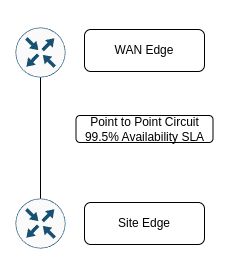
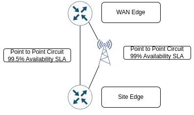
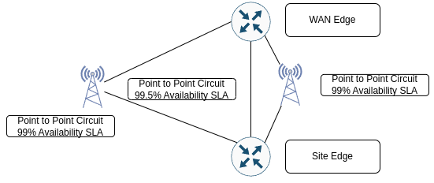
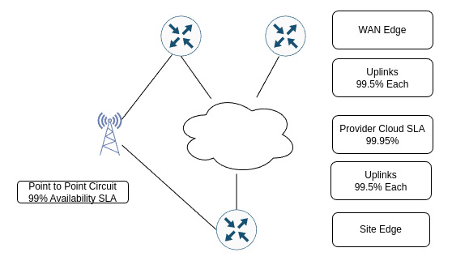

One of my hot topics in my past that I haven't seen written about often is the calculation of WAN availability and what the design is built for. There is often the number of 9's whether that is 5 9s or 3 9s or otherwise, where do you start? Well, in the past the [post by EventHelix.com](https://www.eventhelix.com/fault-handling/system-reliability-availability/) outlines system reliability. It talks about designing systems in parallel and in serial. What does that mean. Well, I am going to take the system availability and bring it into the Wide Area Network, which really could be brought to any environment that has a system uptime requirement as a way to calculate and validate the dollars that you are requesting. I am hoping that this will help you to be able to answer questions such as "What if we added another service provider?" or "What if we changed out hardware for a smaller/larger hardware choice?".

## The Nines

The first topic is to take a look at exactly what it means from a design availability perspective. When talking about availability the nines look like the following of availability from 525,600 minutes in a year (365 x 24 x 60):

| Availability | Downtime    |
| ------------ | -------------------- |
| 99%          | 5,256 minutes (3.65 days) |
| 99.9%        | 525.6 minutes |
| 99.99%       | 52.6 minutes |
| 99.999%      | 5.26 minutes |

As you can see from the chart, the more nines of availability that you must target, the much more aggressive amount of downtime that is acceptable. Many data centers have had a target of 5 nines of availability for many years, and that target may always be changing as well.

Historically in the WAN space you may get asked to design a WAN, validate the current design, or be asked what it would look like if you changed the design. By using a calculation of system availability you can then tie the WAN design back to real figures. So how do I build a design? Let's start by taking a look at a few of the components to do this.

## Calculating Systems Availability

Before we get into a few examples that will back this up, let's first talk about the components and their calculations that will need to come into play in this math problem.

### Circuits / MPLS Networks

The first part is looking at the circuits and MPLS networks (or other network types) that come into play. These are the easier part actually. The circuits and network from providers will come with an availability SLA. Now there are other factors that come into play on whether or not the carrier/provider meet the SLAs. But that is the percentage number that will be used in calculating.

### Device Availability

The calculation provided by EventHelix's post makes sense here. The availability of a network device is calculated from having two numbers. MTBF (Mean Time Between Failure) and MTTR (Mean Time To Recovery). MTBF is a figure that is provided about how many hours that a device is expected to operate between failures. This is a number that is often available from your hardware vendors, and increasingly more difficult to find publicly. The MTTR is a number that you are expecting for how long it may take to replace the device or recover from a failure manually. In some environments this may be an SLA from a provider as well or you may have to put an educated guess to this.

## System Availability

From the calculation documented before, there are two parts that I do when calculating a WAN availability. First I flatten down to get the components into a series as much as possible. So if you have two routers providing WAN edge services to an MPLS cloud, the first thing you calculate is the flattened availability of the WAN edge. Once you have everything in a series, the math becomes pretty quick. 

Availability = (MTBF) / (MTBF + MTTR)

### Parallel System Availability

At each of the layers, you break things down into just a single availability for each of the systems. This means that you need to be able to calculate for a system that has parallel availability. You will see more in the second example below. So for now, the calculation that you need to know is that for finding availability of a system component that has a parallel option is:

Availability = 1 - (1 - Ax) * (1 - Ay)

Where `Ax` is the availability of component x (first circuit) and `Ay` is the availability of component y (secondary circuit).

## WAN Design Availability Examples

Let's start with some designs as a way to calculate the expected availability of a WAN environment. For the device types, I am going to use various Meraki devices as a method to help show since there is a post that is publicly available of what the MTBF is for the devices. Take a look [here](https://community.meraki.com/t5/Wireless-LAN/MTBF-MR74-and-MR53/m-p/50833#M7771) for the numbers that are posted (into a table below). 


One assumption that does also need to be taken into account is power as well. That will be the one component that needs to get calculated in that for the sake of the blog we will assume will be 100% availability.


| Device | MTBF |
| ------ | ---- |
| MR42 | 450,000h |
| MX64 | 1,273,000h |
| MX84 | 925,000h |
| MX100 | 389,000h |
| MX250 | 336,800h |
| MX450 | 336,800h |

### Basic, Two Routers Connected Via Point to Point Circuit

This is the design basic components. There is only one component at each level:

Ok, so there are a few options now, other than the circuits having a single availability percentage. Let's take a look at a table of what these may look like for site availability. The WAN circuit will have an SLA of 99.5% availability and let's explore using different pieces of hardware.

| WAN Edge Device | Site Edge Device | Edge Repair Time | Site Repair Time | WAN Edge Availability | Site Edge Availability | WAN Availability | Total Availability |
| --------------- | ---------------- | ---------------- | ---------------- | --------------------- | ---------------------- | ---------------- | ------------------ |
| MX84            | MR42             | 8h               | 24h              | 99.99914%             | 99.99822%              | 99.5%           | 99.497% (2642 minutes of downtime) | 
| MX84            | MX64             | 8h               | 24h              | 99.99914%             | 99.99937%              | 99.5%           | 99.499% (2636 minutes of downtime) |
| MX64            | MX64             | 8h               | 24h              | 99.99937%             | 99.99937%              | 99.5%           | 99.499% (2635 minutes of downtime) |

What we see here is that while hardware absolutely comes into play for helping on the availability. The MX64 which has a much longer MTBF, 4 times as much, will still only get an expected availability of 7 minutes more of up time. The limiter is still the single WAN circuit availability of 99.5%.

### Small WAN, Adding a Backup Link

Now it has been a while since I have been ordering circuits, so I'm going to go with an extreme light example as a backup circuit. I don't know that cellular providers are providing a SLA of service availability, but let's add a secondary circuit that would be cellular or broadband provider. Let's then assume that the second circuit has an availability of 99% along with it, which would allow for 3 days+ per year of service outage.

Using the calculation above for calculating the availability of a secondary circuit you now get a WAN availability of 99.99% - four nines by just adding an inexpensive WAN circuit. Let's see what that does to the calculations of availability:

| WAN Edge Device | Site Edge Device | Edge Repair Time | Site Repair Time | WAN Edge Availability | Site Edge Availability | WAN Availability | Total Availability |
| --------------- | ---------------- | ---------------- | ---------------- | --------------------- | ---------------------- | ---------------- | ------------------ |
| MX84            | MR42             | 8h               | 24h              | 99.99914%             | 99.99822%              | 99.995%           | 99.992% (40 minutes of downtime) | 
| MX84            | MX64             | 8h               | 24h              | 99.99914%             | 99.99937%              | 99.995%           | 99.99% (34 minutes of downtime) |
| MX64            | MX64             | 8h               | 24h              | 99.99937%             | 99.99937%              | 99.995%           | 99.998% (33 minutes of downtime) |

Very quickly are we getting to diminishing returns on what we can add to the system to make it more available before it gets too complex. Let's throw a second backup link into the mix before we start to explore adding in additional components at the WAN Edge layer.

### Small WAN, Two Backup Links

This is where the design may start to get a bit unwieldy, and there is a cost for the complexity of hte network. That is just much more difficult to quantify. When adding a third circuit that has a 99% availability number with it, you get to having 6 nines and a 5. The 5 comes from the original circuit of 99.5% availability.

| WAN Edge Device | Site Edge Device | Edge Repair Time | Site Repair Time | WAN Edge Availability | Site Edge Availability | WAN Availability | Total Availability |
| --------------- | ---------------- | ---------------- | ---------------- | --------------------- | ---------------------- | ---------------- | ------------------ |
| MX84            | MR42             | 8h               | 24h              | 99.99914%             | 99.99822%              | 99.99995%        | 99.997% (14 minutes of downtime) | 
| MX84            | MX64             | 8h               | 24h              | 99.99914%             | 99.99937%              | 99.99995%        | 99.998% (8 minutes of downtime) |
| MX64            | MX64             | 8h               | 24h              | 99.99937%             | 99.99937%              | 99.99995%        | 99.999% (7 minutes of downtime) |

The third circuit gets your site availability expectation to 7 minutes of downtime where both ends of the circuit are having MX64 devices terminate the circuits. That is getting pretty darn good on the availability. 

### MPLS Network With Two Uplinks At Edge, Site with One and Backup

One of the common practices now days is to have multiple edge routers at the WAN edge in the data center that provides connectivity to the cloud portion of the WAN run by the providers. Let's take a look at this design:

Now you can see that the layers have expanded here significantly. There are now five layers to take into consideration. Rather than include the repair times in the table, I'm removing those for brevity here. 

| Site Edge Availability | Site WAN Availability (Not the Backup Link) | MPLS Availability | WAN Edge Availability to Provider | Backup Network Availability | WAN Edge Availability | Total Availability    |
| ---------------------- | ------------------------------------------- | ----------------- | --------------------------------- | --------------------------- | --------------------- | --------------------- |
| 99.99937%              | 99.5%                                       | 99.95%            | 99.9975%                          | 99%                         | 99.99874%             | 99.9925% (39 minutes) |


This shows that the availability number here is slightly worse than what you may get from having multiple back ups earlier above. This is where the network architecture also needs to take into account the criticality of the path. If this is the design for a single site to single site it may not be optimal (depending on the service profile).


## Summary

When it comes to WAN design, there are multiple options and methods to design your Wide Area Network. You are able to put together calculations to be able to affirm that you have the right design to meet the business requirements for the WAN. The next challenge is then to get the appropriate uptime metric as often you may get "The WAN needs to be online all of the time". At this point you can put together general costs of providing the services at different service levels. This has been one of my favorite topics over the years and wanted to share. Hope that some may have found this helpful in articulating WAN design and costs!

-Josh