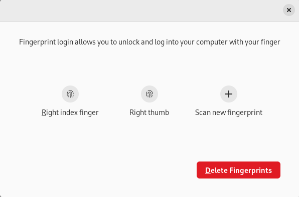
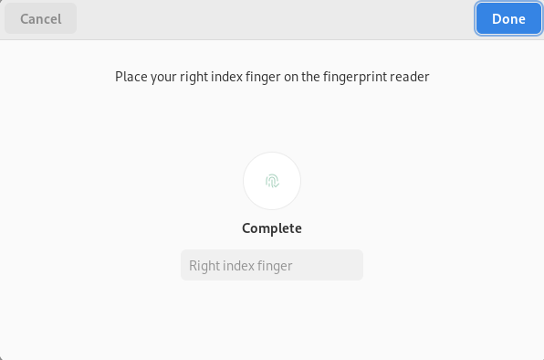

As a long time MacBook user and of recent years on the M1 using the TouchID system that allows for fingerprint authentication, this is something that I wanted to get to work pretty quickly for myself. I had tried a couple of different options to get fingerprint reading to work. Through the 3 methods, I finally have one that works, and I figured it would be worth the share.

<!--more-->

## Attempted Routes

Now some of these may seem foolish as I write after the fact. But I had some reason to think that there would be success. The three options that I tried (only the last/third one worked):

- Kensington VeriMark
- Yubikey Bio
- DigitalPersona 4500

### Kensington Verimark

Why did I try this? Well, when I searched in the Amazon search box, I searched `Linux Desktop Fingerprint Reader`. This was Amazon's top choice. I went with it before researching further - my mistake. Once I received the tiny USB device, plugged it in, and nothing happened I went looking a bit further. Upon further research, this only had drivers for Windows and Mac. Makes sense. Those are the two biggest players. So this was a no go.

### Yubikey Bio

I thought to myself, let's try the Yubikey Bio, since there is a fingerprint component to it, maybe it would work for fingerprint auth. I could use a Yubikey anyhow myself. This didn't work, kind of obvious with having a third attempt upcoming.

### DigitalPersona 4500

Next I finally found the [Debian docs](https://wiki.debian.org/SecurityManagement/fingerprint%20authentication) on supporting fingerprint authentication. In the page there is a [list of supported devices](https://fprint.freedesktop.org/supported-devices.html) which gave me a few options to run down. I came across the Digital Persona device, which looks a like many of the finger print readers at various medical providers around. I felt better and gave this a go. I went with the [Digital Persona 4500](https://amzn.to/3E4JZSO) off of Amazon. Instant success. I was able to get the finger print reader up and working. I had followed some other online docs that indicated that you only needed to install `fprintd`, this is wrong. You do need `fprintd` and `libpam-fprintd`, which is clearly listed on the Debian docs.

## Reading in the FingerPrint

To read in the finger print on Debian, go to your Activities and search for `Users`. This will bring up the Users setting panel. Now you should have an option of `Fingerprint Login`, which may be set to off by default. Enable this and then you can go to adding some finger prints. You can see that I have a few finger prints already added.

Now to add a new finger print, you select `Scan new fingerprint`. What is not as obvious in this next screen is the process to add your finger print. Do you just put the finger on one time and let it sit? Do I need to use the process that Apple (and likely Android devices) have around putting your finger on multiple times? I found that if I just leave my finger on the scanner, it doesn't do much. So I do recommend the process of adding and removing your finger from the finger print reader. You will see the finger print icon change from grey to blue through the process.

Once it is complete, instead of blue or grey finger print icon you now get a green icon with complete indicated.

## Summary

Finger print authentication is coming along for those with a Debian desktop, not a laptop that has the finger print authentication built in. I'd ideally get this to work next with 1Password and other systems to not have to enter credentials. I believe this will be coming soon. Until then I do like the final choice of the Digital Persona 4500 to handle finger print authentication on my Linux desktop.

