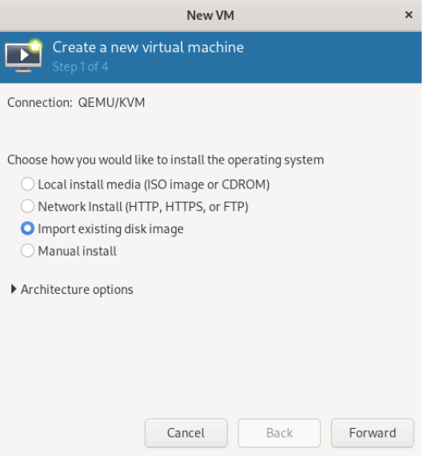

As part of my journey of using my Debian based Dev Workstation, as well as my studies towards completion of the DevNet Expert, I wanted to get up and running with the [DevNet Workstation](https://learningnetwork.cisco.com/s/article/devnet-expert-equipment-and-software-list) example that would help to become familiar with the environment that would be found at the live exam. There were a few small quirks along the way, so I thought I would go ahead and create a post about how to get started.

<!--more-->

## Getting Started

The process will look like the following:

- Download the image file
- Import the image into a new VM
- Validate the access, check for Internet access
- Modify the Netplan
- Restart and enjoy!

### Download the Image

The first part of the process is to get the qcow2 file downloaded from the [Equipment and Software List](https://learningnetwork.cisco.com/s/article/devnet-expert-equipment-and-software-list) in the `Candidate Workstation` section. Once the file is downloaded, I recommend moving the file into a safe location that is not the Downloads folder. That seems to be a place that tends to get overwhelmed with data and then periodically purged.

Once downloaded, then you can create a new VM, I will be using [Virtual Machine Manager](https://virt-manager.org/) as a UI to the KVM system. I won't dive into deep details of the under the hood of what is going on, but get into how I am able to get the host available and online.


I recommend taking a look at [Chris Titus's Tech blog](https://christitus.com/vm-setup-in-linux/) (and likely his YouTube video associated with it) for getting Qemu/KVM and Virtual Machine Manager going.



### Import the Image to a New VM

Now the fun part, which is pretty quick to get going. From the base VMM screen, select new on the upper left hand corner.


On the new window pop up, then select import existing disk image.



Browse to the location of the disk, then on the bottom section type out `Ubuntu 20` to find the OS type of Ubuntu, select Forward.


Select the resources that you want to make available to the host. This is something that you may want to consider giving a few more to than the default, however Linux OS do seem to handle limited resources quite well.


On step 4 you get the option to name the virtual machine. Here it is good to go ahead and give it a meaningful name. Be sure to expand the `Network selection` section, and have this assigned to the bridge interface that is created during the set up of the system for Qemu.


Once you have completed this, now the machine will boot up. The login based on the docs (and thank you Jeff) is `1234QWer!`. 

### Validate Internet Access

To verify what I had seen previously, I test a `ping 1.1.1.1` to see if there is Internet access and there is not.


### Netplan

Taking a look at the network connections I run the command `ip add` and I get the following output, where the interface name is highlighted on line 8.

```bash {hl_lines=["8"]}
(main) expert@expert-cws:~$ ip add
1: lo: <LOOPBACK,UP,LOWER_UP> mtu 65536 qdisc noqueue state UNKNOWN group default qlen 1000
    link/loopback 00:00:00:00:00:00 brd 00:00:00:00:00:00
    inet 127.0.0.1/8 scope host lo
       valid_lft forever preferred_lft forever
    inet6 ::1/128 scope host 
       valid_lft forever preferred_lft forever
2: enp1s0: <BROADCAST,MULTICAST> mtu 1500 qdisc noop state DOWN group default qlen 1000
    link/ether 52:54:00:17:69:d0 brd ff:ff:ff:ff:ff:ff
3: docker0: <NO-CARRIER,BROADCAST,MULTICAST,UP> mtu 1500 qdisc noqueue state DOWN group default 
    link/ether 02:42:74:e1:0a:fc brd ff:ff:ff:ff:ff:ff
    inet 172.17.0.1/16 brd 172.17.255.255 scope global docker0
       valid_lft forever preferred_lft forever

```

On this same host, showing the netplan with the command `cat /etc/netplan/00-cws-dhcp-config.yaml` (tab complete after `/etc/netplan` gets you the file name) you can see that on line 6 that the default workstation interface name has `ens3` rather than the `enp1s0` that you saw on the previous command:

```yaml {hl_lines=["6"]}
# Configure ens160 for DHCP
network:
    version: 2
    renderer: networkd
    ethernets:
        ens3:
            dhcp4: true

# Reference: Configuring Static IP address
# network:
#     version: 2
#     renderer: networkd
#     ethernets:
#         ens160:
#             addresses:
#                 - 10.10.10.2/24
#             nameservers:
#                 search: [mydomain, otherdomain]
#                 addresses: [10.10.10.1, 1.1.1.1]
#             routes:
#                 - to: default
#                   via: 10.10.10.1
```

#### Updating NetPlan

Now, this is where a little bit of Linux commands come out. The user `expert` is not in the sudoers list, so you are not able to use `sudo` to modify the file. However, I found that bringing up the root shell of the root user with `su -` does in fact get you into the root user prompt.

```bash
(main) expert@expert-cws:~$ su -
Password: 
root@expert-cws:~# 
```

With the prompt you see that you are now the root user by the username at the front and the `#` prompt.

Now you can modify the Netplan using vi or nano, or whatever your favorite text editor is from the CLI. While modifying the file, swap out the `ens3:` for whatever interface name that you found on the `ip add` command earlier. In this case making the interface name `enp1s0`. So the output looks like:

```yaml
root@expert-cws:~# cat /etc/netplan/00-cws-dhcp-config.yaml 
# Source: https://netplan.io/examples/

# Configure ens160 for DHCP
network:
    version: 2
    renderer: networkd
    ethernets:
        enp1s0:
            dhcp4: true

```

Once the file is saved, now execute `netplan apply`. You should have no output and bring you back to the same prompt. Now you can ping an address on the internet and get success:

```bash
root@expert-cws:~# ping 1.1.1.1 -c 4
PING 1.1.1.1 (1.1.1.1) 56(84) bytes of data.
64 bytes from 1.1.1.1: icmp_seq=1 ttl=55 time=16.2 ms
64 bytes from 1.1.1.1: icmp_seq=2 ttl=55 time=15.8 ms
64 bytes from 1.1.1.1: icmp_seq=3 ttl=55 time=14.8 ms
64 bytes from 1.1.1.1: icmp_seq=4 ttl=55 time=15.4 ms

--- 1.1.1.1 ping statistics ---
4 packets transmitted, 4 received, 0% packet loss, time 3005ms
rtt min/avg/max/mdev = 14.796/15.568/16.226/0.525 ms

```

## Summary

At this point you now have another device on the network for you to use. You can set up VNC or other system to remote into the environment and use, or just use the Virtual Machine Manager display to work within the workstation. This is something that took me a small bit of time and I was glad to be able to figure out how to accomplish getting the system up and running. What will you do with the DevNet Workstation? Let me know in comments below or on social media!

Josh