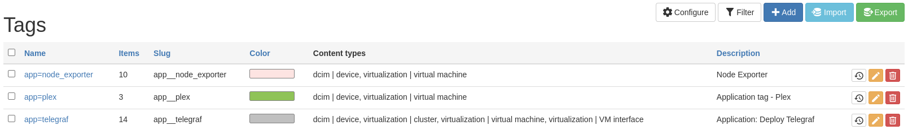

In my home environment I am leveraging Nautobot as my source of truth. This is for the network, which is probably not all that interesting in my home environment, and my virtual machines. Why am I tracking my virtual machines in Nautobot? Simple, to help automate them. I think that this is a clever methodology to help use tags and to get automation working within the environment. This same type of thing may be applicable to your network environment as well.

<!--more-->

## My VM Environment

I'm still in the process at the moment of having to build my virtual machines a bit manual. I hope to automate this some more in the future yet. I'm leveraging an open source hypervisor that is running on several NUC class hosts that make up the cluster. These are running in HA mode, so if one of the hosts go down, then I should have another host that will pick up the slack and take care of running the virtual machine.

## Nautobot Set Up

Within Nautobot I am adding my VMs as I add them onto the host. This is what I will automate and flip around. I am setting up the system as though I were building the VM from Nautobot, and then that goes into the hypervisor system.

Next up, I use tags to define what application systems that are going to be installed onto the environment. So I am effectively using Tags from Nautobot to create the groups for Ansible. 

The first set of tags that I have include:

- app=node_exporter
- app=plex
- app=telegraf

As I work through my virtual machines and devices, I now have the capability to run Ansible playbooks based on the tags. So on the virtual machines that I want to deploy the Telegraf agent to send metrics to my TSDBs, I use the tag of `app-telegraf`. When running the playbook, I have confidence that the machines that I want to have Telegraf will in fact be there.

## Application to Networks

How would I look to apply this process to networking? I would absolutely look to have this same thing set up for tags about what devices need to be in what system. Such as the following tags:

* Monitoring=SystemA
* Monitoring=SystemB
* AAA=RadiusSystemA
* AAA=TacacsSystemA


When I make these tags I also change the slug away from the default value. Changing `=` which will be no space/character in the slugify to be a `__` double underscore.


By leveraging tags you can filter for devices/virtual machines and allow for customization as of the automation that is being deployed. So that you can define in your automation that devices should all be part of a monitoring system. But what if you want to take the device out of monitoring for an extended period of time? Well, you can just change the tag. Or if you want to apply a custom policy, apply a tag to the object and then in the automation check to see if the tag exists.

## Next Step: Automation

The next step for me will be to find the time to set the appropriate WebHook/JobHook for when a device gets updated/created in Nautobot to update the Ansible AWX Inventory that I have. I will likely go to Nautobot JobHook to be able to send updates only when tags are applied. Why JobHook? I can add some logic into the path to be able to handle should there shouldn't there be an update based on the object update.

## Summary

Tags are an awesome and often forgotten capability with a SOT tool like Nautobot. You can leverage tags quite a bit to help control environments and the data that is being added/updated inside of Nautobot. Anything else that you use tags for? What other ideas do you have? Let me know in the comments.

Need a step by step guide on getting started with open source network management tools? Check out my book on [LeanPub](https://leanpub.com/opensourcenetworkmanagement) or on [Amazon](https://amzn.to/45kVu40).

Josh