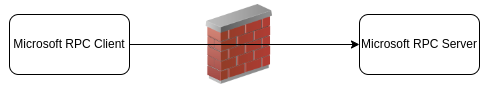

Today I'm going to dive into my getting started with network automation, and perhaps my first successful automation. There are definitely some things that I would re-do and complete differently, and some things that I consider a success.

I'm working on a new series within my blog, about how I would look to have done things differently than I had done before, with the tooling and knowledge that I now have, years later. This is the first in the series.

## Scenario

The issue at hand was there was an issue with a particular firewall system that was causing various connection issues to occur within the Microsoft Office suite of communications. There were some tables that were tracking Microsoft RPC connections through the firewall that were filling up. There were no log messages indicating that this was happening. Nor were there any metrics available via SNMP at the time.

 I forget the details about how it was diagnosed as an issue and made its way to the firewall as the culprit. But that is not important.  

### How The Issue Was Solved

The issue was initially solved by a crawl, walk, walk faster initiative. I would typically go down the path of crawl, walk, run path, but in this case as I look back at things, I would say that there are some other methods that I could have taken to get things further. But was not necessary.

First thing was figuring out how to clear the tables, which was done with a quick command. This was being done whenever there was a report of the tables filling up, which was happening actually relatively frequently. On top of having this information at hand, there was an escalation to the firewall vendor to help alleviate the issue in the firmware.

The next step was creating an HPNA script to be able to be executed by our second level support team whenever the issue was detected or had a call in to clear the tables. This was a start, but still not quite what was looking for.

### The Automation Used

I had been working on developing my Python automation skills at this time. So as a learning opportunity I took the initiative to look at what could I do with a Python script. In this learning time, I had not been so well connected to the community of network automation and thus was not aware of the awesome [Netmiko](https://pynet.twb-tech.com/blog/netmiko-python-library.html) library at the time. So what was I doing? I was essentially recreating it as an internal package. That will be covered more in the next section.

So the script was able to log into the firewall. It then read the command output and using regex to parse the output, looking for the current counter value of the RPC tables. When the counter was maxed out, the script would then clear the tables. The script was then set to run on a cron schedule of every 30 minutes. And at that point, things were good to go until the bug could be solved in a main line code.

### Why Not Upgrade?

The impact was immediate. The anticipated amount of time that it would take the vendor to diagnose and re-create the issue, engineer a patch, and generate an engineering special patch (before being incorporated into the main code base) would take some time. On top of that, the comfort level of running an "Engineering Special" patch on the firewalls was not that comfortable. If that was the only fix, then that would be a route to go. But there was another option. Use the automation that was built.

## What Would I Do Now?

So many years later, knowing what I know now, there are definitely some things that I would do differently. Many are around working with existing tooling (which did exist in a form back then) or contributing back to open source.

### What I Would Do The Same

What would I do the same. First the iterative approach was a good path. I would absolutely look to do the same thing again there.

The second piece that I am proud that I worked within was the use of the corporate security password management. There was no need to store the credentials to log into devices.

Lastly, I'm glad that I used Python to complete the activity. It was something that I could iterate on, had a good time building the script out, and was effective.

### Python Script

First, I wrote everything in Python 2.7. This was when there was still a debate between Python 2.7 and 3.4/3.5. I would absolutely change and move along with using Python 3.x, whichever is the latest as I get started.

The reason that Python 2.7 was chosen at the time was to be able to have something that was compatible with running on network devices, so that as we continued our development, that we could leverage on box Python. This I should have just moved forward to 3.x.

Today Python is moving the version forward rapidly in my opinion. So it is good to plan that if you are just getting started, start with the latest version of Python available. This will help keep longevity in the apps that are developed.

#### Netmiko

At the time I was not aware of the network automation community. I ended up learning the same things that the community and the Kirk Byers Netmiko project had worked through. I was working through how to interact with network devices through the [Paramiko](https://www.paramiko.org/) shell, exactly what had been done before. So I absolutely would have changed to just using the Netmiko library. That is the first thing that I would have done for sure.

#### TextFSM

Next up in what I would do differently is that coupled with using Netmiko, I would use [TextFSM](https://github.com/google/textfsm) to handle the command regex parsing. I am doubting that there would have been an [NTC-Template](https://ntc-templates.readthedocs.io/en/latest/) available for the command, but I would look to create a template based on the command output. At that point when the template was created, I would then look to submit a PR into the NTC-Templates library so that others would be able to use the same template.

Note that Kirk has an excellent [blog post](https://pynet.twb-tech.com/blog/netmiko-and-textfsm.html) about how to use NTC-Templates right in with Netmiko. Previous to the Netmiko 2.0 release, you would need to get the command output and then parse the output separately. These are now all in one with the Netmiko library.

### Monitoring

The last piece with having the script now, I would look to enhance the monitoring of it, to know how often that the tables were filling up, and what the pace was. There are still two methods here, of one generating a log message to send into a logging system. Or to set up a graphing capability using Telegraf, Prometheus, and Grafana. I would look at implementing the graphing solution that I wrote up several years ago on the NTC Blog about [Monitoring VPN infrastructure with Netmiko, NTC-Templates, and a Time Series Database](https://blog.networktocode.com/post/using_python_and_telegraf_for_metrics/)

## Summary

There are definitely some things that I would look to do a small bit differently. But the thing that I like most is that I was able to apply some recently developing skills at the time - Python, to directly get a business outcome. It may have been seen as a break/fix just fixing things, but it was a band aid that was needed, and helped save my personal work/life balance (not having to clear the tables often manually). Network Automation is an ever evolving field. There will be continued maintenance of what is built.

Overall, the journey is about continuing to learn. Learning is one of the important aspects of the DevOps culture. I'm hopeful that this may help others on the journey to either learn from my past (would not call them mistakes), or inspire other thoughts of your own. Let me know what you think.


Cover photo by rivage - https://unsplash.com/photos/woman-in-black-shirt-sitting-beside-black-flat-screen-computer-monitor-Im_cQ6hQo10 on Unsplash

I'm having issues building with new posts containing the key for coverCaption in front matter.
