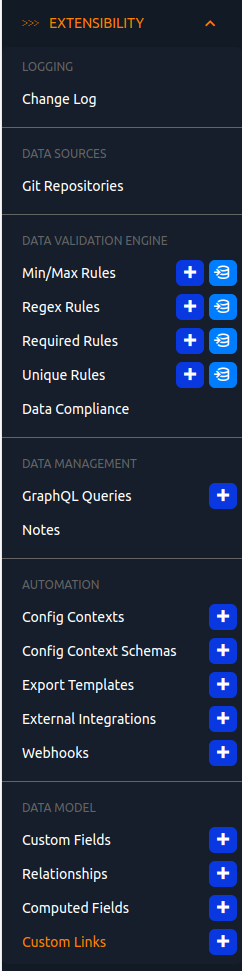
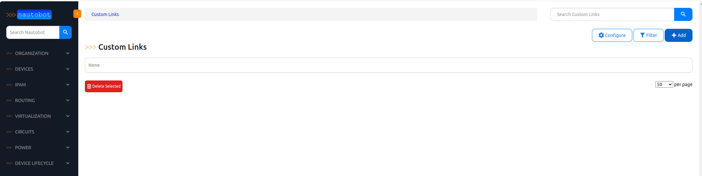
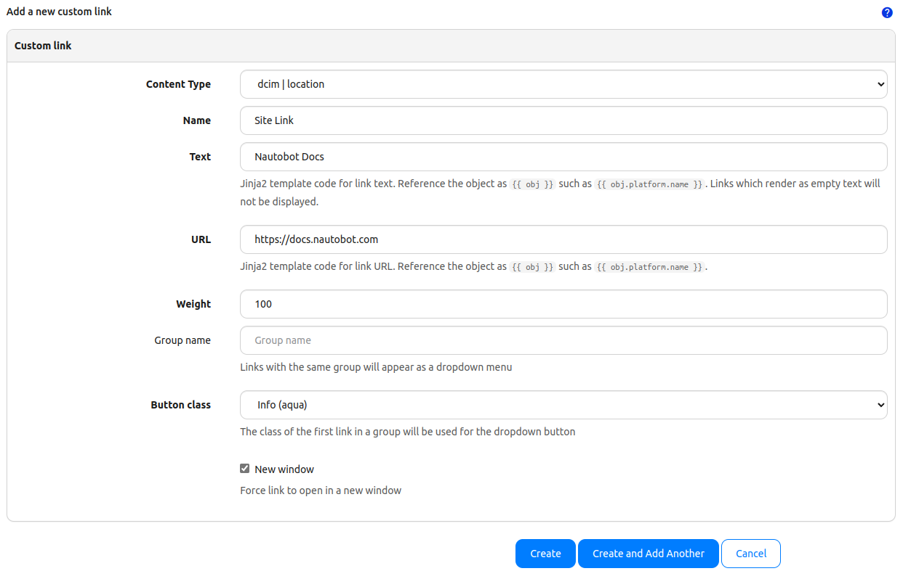
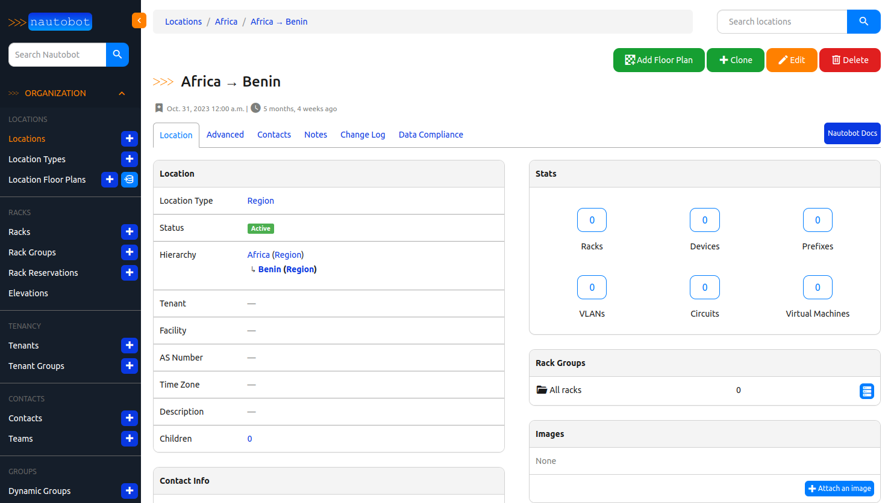
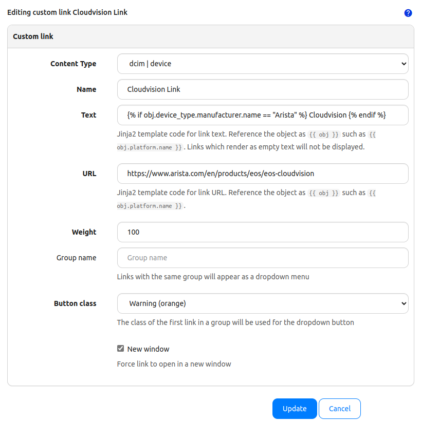
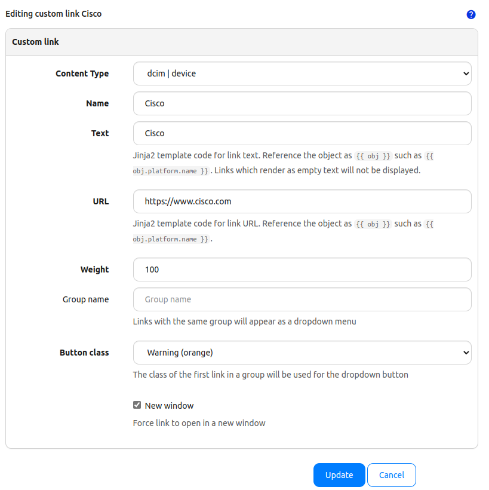
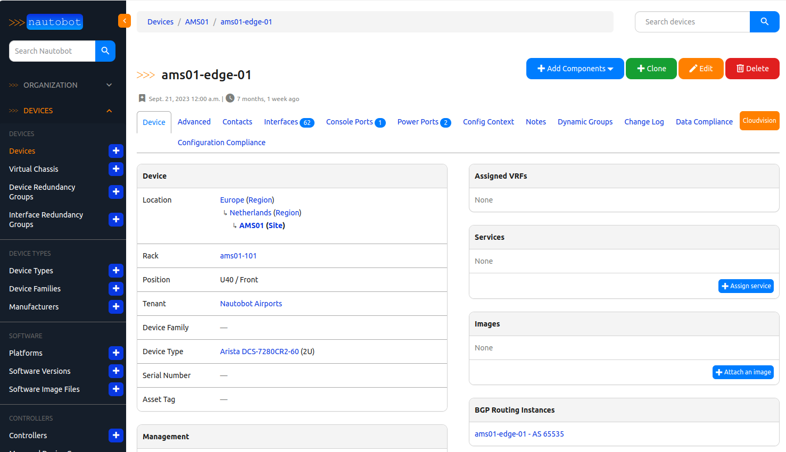
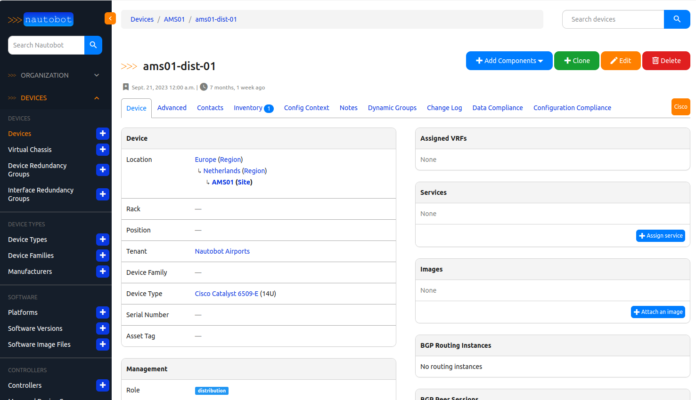

One of my favorite features of Nautobot that may not be well known is the capability to put a button on pages that take you to other locations. This can be helpful when lining up the source of truth as that first place that you go, the idea of adding custom links will just help to enforce that as the first place to go.

The documentation for creating your own custom links is here: [https://docs.nautobot.com/projects/core/en/stable/user-guide/platform-functionality/customlink/](https://docs.nautobot.com/projects/core/en/stable/user-guide/platform-functionality/customlink/)

## Custom Link Build

Custom Links are built in the Nautobot UI under the `Extensibility` menu. Let's build a basic button on the [demo instance of Nautobot](https://demo.nautobot.com). Let's build a link for Locations that will point to the Nautobot docs page as an example. Some ideas for actual implementations include links to site dashboards in your monitoring tool, or a link on a circuit to the portal page, or a link to CI data inside of your ITSM tool for a device.

1. Navigate and log into https://demo.nautobot.com (Log in credentials are on the site, as of now demo/nautobot)
2. On the left hand navigation menu, select `EXTENSIBILITY` and then select `Custom Links`

3. The site by default does not have any links, there may be a few that demo users create themselves.

4. Select +Add on the upper right
5. Fill out the form with the following:
| Field | Value | Description |
| ----- | ----- | ----------- |
| Content Type | `dcim \| location` | What Nautobot data type this applies to. |
| Name | Site Link | The name of the custom link. | 
| Text | Nautobot Docs | What the button should say. |
| URL | https://docs.nautobot.com | What the link is sending to. |
| Weight | 100 | This helps tweak where the link will appear in relation to other links. |
| Group Name |  | If you want to group links together. |
| Button Class | Info (Aqua) | This colors the button for the link. |
| New Window | Checked | Opens the link in a new tab/window. |



Click on `Create` on the bottom. This will create the link. Now when you navigate to a Location, you will now see a button on the upper right that will say `Nautobot Docs` that will take you to the Nautobot documentation pages.



## Advanced Link Creation

One of the awesome things that comes along with the Custom Links is the ability to put some logic into the text that you put there, such as only show the button if it is a particular device type, or manufacturer. This may also play in with systems that are part of a controller based system. Perhaps a link to Arista Cloudvision if the device is an Arista device. I have done links to Grafana dashboards using the [Modern Telemetry](https://a.co/d/fbv2H4U) system that we have deployed, only if the device is of a particular device type that would be created to be in the monitoring solution.

Let's make two more links using the same steps above, but with the custom logic of a link to CloudVision when the device manufacturer is Arista. If the device manufacturer is Cisco then link to the Cisco controller. In both instances for the demo, it will be a link to the manufacturer's webpage. The custom text we will want is the following (will be a single line in the text of the button):


### Arista CloudVision Custom Link

```python

CloudVision

```

| Field | Value | Description |
| ----- | ----- | ----------- |
| Content Type | `dcim \| device` | What Nautobot data type this applies to. |
| Name | Arista CloudVision | The name of the custom link. | 
| Text | CloudVision | What the button should say. |
| URL | https://www.arista.com/en/products/eos/eos-cloudvision | What the link is sending to. |
| Weight | 100 | This helps tweak where the link will appear in relation to other links. |
| Group Name |  | If you want to group links together. |
| Button Class | Warning (Orange) | This colors the button for the link. |
| New Window | Checked | Opens the link in a new tab/window. |



### Cisco Custom Link

```python

Cisco

```

| Field        | Value                                                  | Description                                                             |
| ------------ | ------------------------------------------------------ | ----------------------------------------------------------------------- |
| Content Type | `dcim \| device`                                       | What Nautobot data type this applies to.                                |
| Name         | Cisco                                                  | The name of the custom link.                                            |
| Text         | Cisco | What the button should say.                                             |
| URL          | https://www.cisco.com                                  | What the link is sending to.                                            |
| Weight       | 100                                                    | This helps tweak where the link will appear in relation to other links. |
| Group Name   |                                                        | If you want to group links together.                                    |
| Button Class | Warning (Orange)                                       | This colors the button for the link.                                    |
| New Window   | Checked                                                | Opens the link in a new tab/window.                                     |



## Demonstration

Now when you navigate to devices on Nautobot, when the device type manufacturer is present, you have new buttons that are available. Taking a look at an [Arista device](https://demo.nautobot.com/dcim/devices/37a938b0-bd5a-4c25-9d98-a51c75d15ba9/?tab=main) you now see the CloudVision button the top right.



And when you navigate to a [Cisco device](https://demo.nautobot.com/dcim/devices/89b2ac3b-1853-4eeb-9ea6-6a081999bd3c/?tab=main) as expected you have the Cisco button.



## Summary

Nautobot's Custom Links are a valuable part of building out the Network Automation Source of Truth. Knowing that there are going to be other systems, it is good to link to those other systems to help speed access to the particular device types. This is one more thing that will help drive the source of truth concept that is valuable inside of an organization, by allowing it to be a starting point of what the system should look like, and quickly accessing other data points that would be of value. I personally am a big fan of the Custom Links and have been driving them for a while. Custom Links are available in all versions of Nautobot.

Thanks for reading!

-Josh