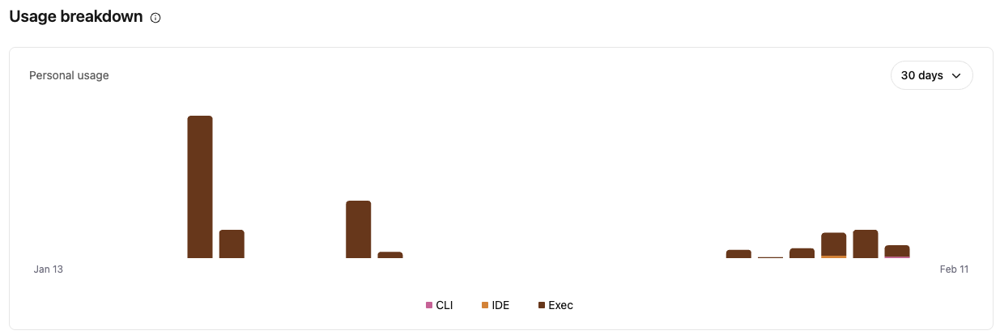

A year ago I called AI a 50/50 bet — half the time it worked, half the time I was re-checking and re-prompting. I was paying $20 a month to multiple providers just to keep an eye on things. AI was around, but it wasn't transforming how I worked. Not yet.

Then a few weeks ago, something clicked. And I burned through my Anthropic and OpenAI credits faster than I thought possible.

It's early 2026, and many are pointing to the [Opus 4.6 Release](https://www.anthropic.com/news/claude-opus-4-6) and [GPT5.3](https://openai.com/index/introducing-gpt-5-3-codex/) as a pivotal point in the AI space. I'd agree, but I'd also say the previous generation of models were already laying the groundwork. What changed was how I started using them.

> [!WARNING] OpenClaw Warning
> If you are looking to go out and run this yourself, please don't jump right into the automated VPS deployment of OpenClaw without thinking and securing it. There are many one-click solutions out there advertising. I do not personally recommend this and in fact would try to persuade you to run on some local hardware that is not from your company.

## The Ralph Loop

It started with the [Ralph Loop](https://ghuntley.com/loop/). The concept is straightforward — you give the AI a task, it builds, tests, and iterates in a loop until it's done. No hand-holding between steps. I tried it and blew through my credits in no time. Take a look at the spikes in usage: . Those spikes were new features I was building for an app I thought I could ship. Except the paid app I already use came out with all of those features anyway. Which is great! One less thing for me to have to ask those around me to use.

But that was just the start.

## Discovering OpenClaw

For the past couple of weeks I have been using AI to help me out a little more at a time. Using Claude Code both in CLI and in the Desktop App, **exploring** what its capabilities are. And I have to say that it is pretty awesome.

Then out of the blue for me — maybe not for others — up pops OpenClaw (Clawdbot -> Moltbot -> OpenClaw). My cousin put out an [article on his blog](https://aaronstuyvenberg.com/posts/clawd-bought-a-car) about using Clawdbot at the time to help him in the car buying experience. That's when it started to click about what the capabilities might be. Then I started to see what a few YouTube personalities were doing, and I said yes, I need to be getting in on this. So I spun up a VM on my home compute and I'm diving head first. The first week went well, and I'm looking forward to doing more.

I'm also looking to dive into local models. I finally have my use case: a 24/7 available AI system that isn't too crazy and isn't too expensive. More on that in a future post.

There are multiple components that make up the sauce of OpenClaw and makes it powerful. Some of that is explained more in this [video on YouTube](https://www.youtube.com/watch?v=XmweZ4fLkcI&t=636s).

### Memory

One of the pieces that really sets OpenClaw apart is memory. Using simple Markdown files, the system remembers what you've talked about from chat to chat — your preferences, your decisions, your context. It's like having an assistant that actually knows you. Many LLMs are just starting to build this in natively, but OpenClaw has it working now.

### Skills

[AI Agent Skills](https://platform.claude.com/docs/en/agents-and-tools/agent-skills/overview) are reusable instructions — written in plain English — that teach AI agents how to use tools properly. It's the DRY (Don't Repeat Yourself) principle at its finest. And this isn't unique to OpenClaw — Claude, Gemini, Codex all have them. It is going to take some time to build out the skills needed to get these systems working in tip top shape, but the investment pays off quickly.

For example, instead of telling Claude how to format a commit message every single time, you write the skill once and it just knows. Instead of describing your project's testing conventions on every prompt, a skill file handles it. The AI agent systems already have a lot of capability and pattern matching built in. Skills just instruct the systems how to use what they have in their toolbox.

## Summary

So, should I be looking at OpenClaw or Claude Code? I think **<u>both</u>**. Using AI systems that are directed by a human first and foremost makes sense. Having a person in the loop and making sure that things are being done and meet our standards — that is where we are at in Q1 of 2026 anyway in my mind.

I went from paying $20 a month to barely touch AI, to burning through credits in days because I couldn't stop building. That shift happened fast, and I don't think I'm unique. We are hitting on something here. [Matt Shumer](https://x.com/mattshumer_/status/2021256989876109403) captures it well in his post — it's a terrific read, and I agree that we are at a pivotal point.

There will be a lot more exciting and challenging things happening. The best advice I can give is be willing to learn and **explore**. I'm looking forward to where the journey is taking me and there are still really good things to come.

What are your thoughts? Comment below.

> [!NOTE]- AI Editing Disclosure
> This post was edited with the assistance of Claude Opus 4.6. The ideas and experiences are mine — the AI helped tighten the structure and clarity.

-Josh
