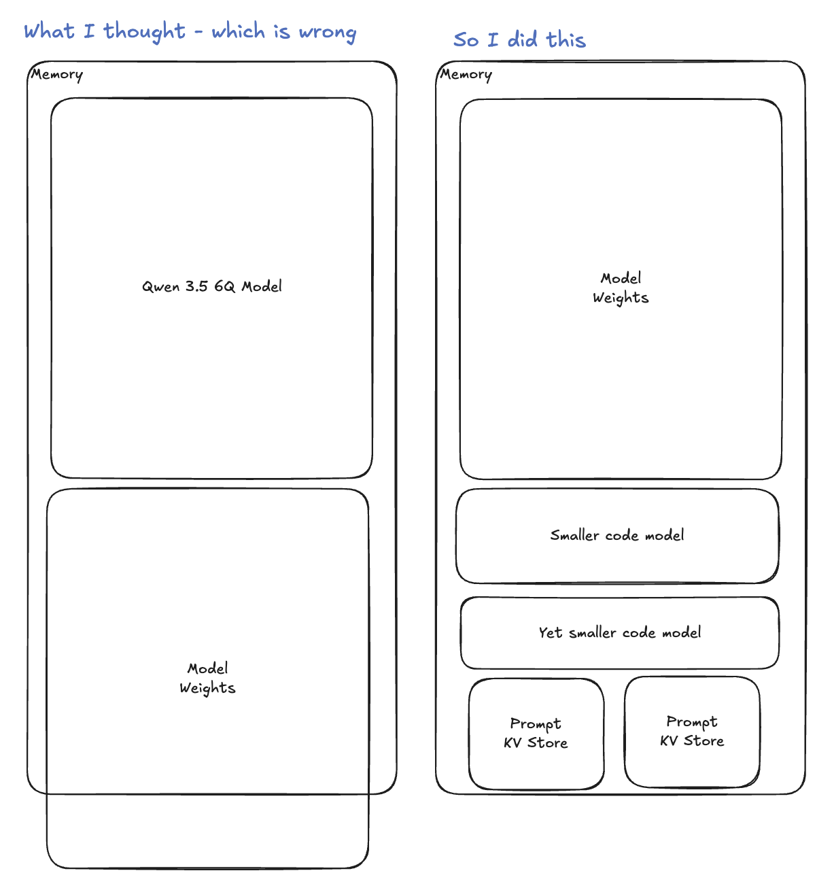
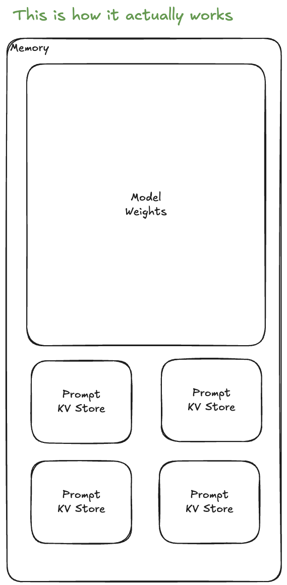

For a long while I was getting it all wrong with my setup of AI local inference. I thought that for each sub-agent that I would spin up on my OpenClaw, the system would use that amount of VRAM. I've been running [Qwen3.5-122B-A10B](https://huggingface.co/unsloth/Qwen3.5-122B-A10B-GGUF) at 6-bit quantization. This model uses 101GB when loading the weights. So I thought if I had two sub-agents using this model, I would need 202GB of RAM. **I was wrong**.

So what I was doing was loading multiple models into my system and pointing different sub-agents at different models. My heavy coding agent would use a much lighter model than the one I was using for reasoning and research.

## Introduction to Weights

I finally went ahead and asked an AI system (I forget which one - Harry, Gemini, ChatGPT, or Claude). I asked the simple question: do I need to have multiple models running for each sub-agent to work simultaneously? The quick answer was no. I then learned that the bulk of the memory numbers you see quoted are for [AI Model Weights](https://www.ntia.gov/programs-and-initiatives/artificial-intelligence/open-model-weights-report/background) - the trained parameters that get loaded into memory and used to respond to prompts.

The weights are loaded once into memory. On top of that, each active request gets a KV-cache - a working memory that stores the computed attention keys and values for the current context. The KV-cache is dynamic: it grows with each token processed and is allocated per-slot, not per-model. So running 4 agents against one model means one copy of weights + 4 small KV-caches, not 4 copies of the model.

Here is what is actually happening on the system:

## Summary

The technology road is quite the journey. This might be a "yeah, you didn't know that?" moment for some, but I didn't, and I've learned. Since consolidating all my sub-agents onto the same local model, the performance across the board has improved significantly - even for the agents that were previously on smaller models. The system is more stable, and I'm getting better results.

If I had this misunderstanding, there's a non-zero chance someone else does too. Hope this helps.

-Josh
