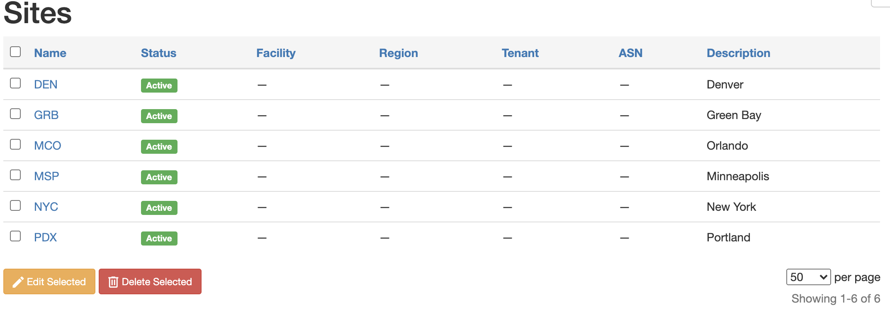

This post dives into the [Nautobot Ansible Content Collection](https://nautobot-ansible.readthedocs.io/en/latest/) sites module to create/update a [Site](https://nautobot-ansible.readthedocs.io/en/latest/plugins/site_module.html). This series for the beginning will be a clone of what I had done previously with NetBox. So some of the language will be very similar. 

When it comes to creating and deleting sites in Nautobot, the question of should I be using Ansible to do this? In my opinion this is a **yes it should be**. Most likely an IT tool is not the tool that will be the Source of Truth as it comes to physical sites involved in an organization. So this module in particular that should be looked at and put into production use with Ansible.

<!-- more -->

## Environment

For this demo, here are the versions shown:

| Component                   | Version  |
| --------------------------- | -------- |
| Nautobot                    | v1.0.0b2 |
| Nautobot Ansible Collection | v1.0.2   |
| pynautobot                  | 1.0.0    |

## Site Module

Within Nautobot, the site is the most basic unit, and is required for devices to be added. This is the first thing that you should do when creating a Nautobot instance is to start to build out sites. There are a many set of parameters that you can add to your sites, but the minimum required are:

- name: The name of the site

Take a look at the [documentation](https://nautobot-ansible.readthedocs.io/en/latest/plugins/site_module.html) for all of the additional parameters. The ones that stick out to me (and there are many more) include:

- asn: The BGP AS Number
- contact name & email: Site contact information
- physical and shipping addresses
- tags
- time_zone

## Examples

In this getting started demos I will be showing how things look with demo data maintained within YAML. In reality this is data that would be sourced from some other location, hopefully able to be gathered via an API. The following data will be added to the environment:

```yaml
---
sites:
  - name: MSP
    time_zone: America/Chicago
    status: active
    description: Minneapolis
  - name: DEN
    time_zone: America/Denver
    status: active
    description: Denver
  - name: NYC
    time_zone: America/New_York
    status: active
    description: New York
  - name: PDX
    time_zone: America/Los_Angeles
    status: active
    description: Portland
  - name: GRB
    time_zone: America/Chicago
    status: active
    description: Green Bay
  - name: MCO
    time_zone: America/New_York
    status: active
    description: Orlando

```

Running the following playbook multiple times will show that the module itself is idempotent in that it will not keep creating sites.

> You will notice one difference with the module compared to the NetBox collections. Instead of specifying `nautobot` everywhere, one just needs to put what it is that is being referenced. In this example instead of `nautobot_site`, it is `site`. And instead of `nautobot_token` or `nautobot_url`, it is just `token` and `url`.

```yaml
---
- name: "SETUP SITES"
  hosts: localhost
  connection: local
  gather_facts: no
  tasks:
    - name: "10 - SETUP SITES"
      networktocode.nautobot.site:
        url: "{{ lookup('env', 'NAUTOBOT_URL') }}"
        token: "{{ lookup('env', 'NAUTOBOT_TOKEN') }}"
        data: "{{ site }}"
        state: present
        validate_certs: False
      loop: "{{ sites }}"
      loop_control:
        loop_var: site
        label: "{{ site['name'] }}"

    - name: "20 - REMOVE CLOSED SITES"
      when: "closed_sites is defined"
      networktocode.nautobot.site:
        url: "{{ lookup('env', 'NAUTOBOT_URL') }}"
        token: "{{ lookup('env', 'NAUTOBOT_TOKEN') }}"
        data: "{{ site }}"
        state: absent
        validate_certs: False
      loop: "{{ closed_sites }}"
      loop_control:
        loop_var: site
        label: "{{ site['name'] }}"


```

On the first run from an empty Nautobot host, there are changes for each of the sites:

```yaml
josh-v@a6339c74e30d:~$ ansible-playbook add_sites.yml -vv
ansible-playbook 2.10.6
  config file = /local/ansible.cfg
  configured module search path = ['/local/.ansible/plugins/modules', '/usr/share/ansible/plugins/modules']
  ansible python module location = /usr/local/lib/python3.7/site-packages/ansible
  executable location = /usr/local/bin/ansible-playbook
  python version = 3.7.10 (default, Feb 16 2021, 19:28:34) [GCC 8.3.0]
Using /local/ansible.cfg as config file
[WARNING]: No inventory was parsed, only implicit localhost is available
[WARNING]: provided hosts list is empty, only localhost is available. Note that the implicit localhost does not match 'all'
redirecting (type: callback) ansible.builtin.yaml to community.general.yaml
redirecting (type: callback) ansible.builtin.yaml to community.general.yaml
Skipping callback 'default', as we already have a stdout callback.
Skipping callback 'minimal', as we already have a stdout callback.
Skipping callback 'oneline', as we already have a stdout callback.

PLAYBOOK: add_sites.yml ****************************************************************************************************
1 plays in add_sites.yml

PLAY [SETUP SITES] *********************************************************************************************************
META: ran handlers

TASK [10 - SETUP SITES] ****************************************************************************************************
task path: /local/add_sites.yml:7
changed: [localhost] => (item=MSP) => changed=true 
  ansible_loop_var: site
  msg: site MSP created
  site:
    description: Minneapolis
    name: MSP
    status: active
    time_zone: America/Chicago
changed: [localhost] => (item=DEN) => changed=true 
  ansible_loop_var: site
  msg: site DEN created
  site:
    description: Denver
    name: DEN
    status: active
    time_zone: America/Denver
changed: [localhost] => (item=NYC) => changed=true 
  ansible_loop_var: site
  msg: site NYC created
  site:
    description: New York
    name: NYC
    status: active
    time_zone: America/New_York
changed: [localhost] => (item=PDX) => changed=true 
  ansible_loop_var: site
  msg: site PDX created
  site:
    description: Portland
    name: PDX
    status: active
    time_zone: America/Los_Angeles
changed: [localhost] => (item=GRB) => changed=true 
  ansible_loop_var: site
  msg: site GRB created
  site:
    description: Green Bay
    name: GRB
    status: active
    time_zone: America/Chicago
changed: [localhost] => (item=MCO) => changed=true 
  ansible_loop_var: site
  msg: site MCO created
  site:
    description: Orlando
    name: MCO
    status: active
    time_zone: America/New_York

TASK [20 - REMOVE CLOSED SITES] ********************************************************************************************
task path: /local/add_sites.yml:19
skipping: [localhost] => changed=false 
  skip_reason: Conditional result was False
META: ran handlers
META: ran handlers

PLAY RECAP *****************************************************************************************************************
localhost                  : ok=1    changed=1    unreachable=0    failed=0    skipped=1    rescued=0    ignored=0   


```


The output below is from a second run and shows that all of the sites already exist and that the idempotency is working well.

```yaml
josh-v@a6339c74e30d:~$ ansible-playbook add_sites.yml -vv
ansible-playbook 2.10.6
  config file = /local/ansible.cfg
  configured module search path = ['/local/.ansible/plugins/modules', '/usr/share/ansible/plugins/modules']
  ansible python module location = /usr/local/lib/python3.7/site-packages/ansible
  executable location = /usr/local/bin/ansible-playbook
  python version = 3.7.10 (default, Feb 16 2021, 19:28:34) [GCC 8.3.0]
Using /local/ansible.cfg as config file
[WARNING]: No inventory was parsed, only implicit localhost is available
[WARNING]: provided hosts list is empty, only localhost is available. Note that the implicit localhost does not match 'all'
redirecting (type: callback) ansible.builtin.yaml to community.general.yaml
redirecting (type: callback) ansible.builtin.yaml to community.general.yaml
Skipping callback 'default', as we already have a stdout callback.
Skipping callback 'minimal', as we already have a stdout callback.
Skipping callback 'oneline', as we already have a stdout callback.

PLAYBOOK: add_sites.yml ****************************************************************************************************
1 plays in add_sites.yml

PLAY [SETUP SITES] *********************************************************************************************************
META: ran handlers

TASK [10 - SETUP SITES] ****************************************************************************************************
task path: /local/add_sites.yml:7
ok: [localhost] => (item=MSP) => changed=false 
  ansible_loop_var: site
  msg: site MSP already exists
  site:
    description: Minneapolis
    name: MSP
    status: active
    time_zone: America/Chicago
ok: [localhost] => (item=DEN) => changed=false 
  ansible_loop_var: site
  msg: site DEN already exists
  site:
    description: Denver
    name: DEN
    status: active
    time_zone: America/Denver
ok: [localhost] => (item=NYC) => changed=false 
  ansible_loop_var: site
  msg: site NYC already exists
  site:
    description: New York
    name: NYC
    status: active
    time_zone: America/New_York
ok: [localhost] => (item=PDX) => changed=false 
  ansible_loop_var: site
  msg: site PDX already exists
  site:
    description: Portland
    name: PDX
    status: active
    time_zone: America/Los_Angeles
ok: [localhost] => (item=GRB) => changed=false 
  ansible_loop_var: site
  msg: site GRB already exists
  site:
    description: Green Bay
    name: GRB
    status: active
    time_zone: America/Chicago
ok: [localhost] => (item=MCO) => changed=false 
  ansible_loop_var: site
  msg: site MCO already exists
  site:
    description: Orlando
    name: MCO
    status: active
    time_zone: America/New_York

TASK [20 - REMOVE CLOSED SITES] ********************************************************************************************
task path: /local/add_sites.yml:19
skipping: [localhost] => changed=false 
  skip_reason: Conditional result was False
META: ran handlers
META: ran handlers

PLAY RECAP *****************************************************************************************************************
localhost                  : ok=1    changed=0    unreachable=0    failed=0    skipped=1    rescued=0    ignored=0   


```

In here we see that there was the single task showing **ok** and no tasks in the other sections of the play recap. The Nautobot sites page looks like:



### Removing a site

Now let's take a look of using the absent. I'm going to get the data by putting MCO into the closed sites key. A full production instance of this would need to first lookup the data within Nautobot, then determine which sites are open and closed. That is beyond the scope of the purpose of this blog, which is to show the executions. That is a little more logic that is very easily done in Ansible either with Ansible native tasks or from an Ansible filter or action plugin.  

The data looks like the following:

```yaml
---
sites:
  - name: MSP
    time_zone: America/Chicago
    status: active
    description: Minneapolis
  - name: DEN
    time_zone: America/Denver
    status: active
    description: Denver
  - name: NYC
    time_zone: America/New_York
    status: active
    description: New York
  - name: PDX
    time_zone: America/Los_Angeles
    status: active
    description: Portland
  - name: GRB
    time_zone: America/Chicago
    status: active
    description: Green Bay
closed_sites:
  - name: MCO
    time_zone: America/New_York
    status: active
    description: Orlando
```

With a closed site, the next playbook run will then remove the site MCO and have the appropriate setup in place.

```yaml
josh-v@a6339c74e30d:~$ ansible-playbook add_sites.yml -vv
ansible-playbook 2.10.6
  config file = /local/ansible.cfg
  configured module search path = ['/local/.ansible/plugins/modules', '/usr/share/ansible/plugins/modules']
  ansible python module location = /usr/local/lib/python3.7/site-packages/ansible
  executable location = /usr/local/bin/ansible-playbook
  python version = 3.7.10 (default, Feb 16 2021, 19:28:34) [GCC 8.3.0]
Using /local/ansible.cfg as config file
[WARNING]: No inventory was parsed, only implicit localhost is available
[WARNING]: provided hosts list is empty, only localhost is available. Note that the implicit localhost does not match 'all'
redirecting (type: callback) ansible.builtin.yaml to community.general.yaml
redirecting (type: callback) ansible.builtin.yaml to community.general.yaml
Skipping callback 'default', as we already have a stdout callback.
Skipping callback 'minimal', as we already have a stdout callback.
Skipping callback 'oneline', as we already have a stdout callback.

PLAYBOOK: add_sites.yml ****************************************************************************************************
1 plays in add_sites.yml

PLAY [SETUP SITES] *********************************************************************************************************
META: ran handlers

TASK [10 - SETUP SITES] ****************************************************************************************************
task path: /local/add_sites.yml:7
ok: [localhost] => (item=MSP) => changed=false 
  ansible_loop_var: site
  msg: site MSP already exists
  site:
    description: Minneapolis
    name: MSP
    status: active
    time_zone: America/Chicago
ok: [localhost] => (item=DEN) => changed=false 
  ansible_loop_var: site
  msg: site DEN already exists
  site:
    description: Denver
    name: DEN
    status: active
    time_zone: America/Denver
ok: [localhost] => (item=NYC) => changed=false 
  ansible_loop_var: site
  msg: site NYC already exists
  site:
    description: New York
    name: NYC
    status: active
    time_zone: America/New_York
ok: [localhost] => (item=PDX) => changed=false 
  ansible_loop_var: site
  msg: site PDX already exists
  site:
    description: Portland
    name: PDX
    status: active
    time_zone: America/Los_Angeles
ok: [localhost] => (item=GRB) => changed=false 
  ansible_loop_var: site
  msg: site GRB already exists
  site:
    description: Green Bay
    name: GRB
    status: active
    time_zone: America/Chicago

TASK [20 - REMOVE CLOSED SITES] ********************************************************************************************
task path: /local/add_sites.yml:19
changed: [localhost] => (item=MCO) => changed=true 
  ansible_loop_var: site
  msg: site MCO deleted
  site:
    description: Orlando
    name: MCO
    status: active
    time_zone: America/New_York
META: ran handlers
META: ran handlers

PLAY RECAP *****************************************************************************************************************
localhost                  : ok=2    changed=1    unreachable=0    failed=0    skipped=0    rescued=0    ignored=0   


```

Note that **TASK 20** now is not skipped. This runs and removes the site with a message that the site was deleted. This is once again idempotent, with the capability to run time and again without causing any changes unless changes are required.

## Summary

This module is a very good module with a lot of options to get you started. This is absolutely a module that I would become familiar with as your organization is changing over time. This will allow you to keep your Nautobot environment up to date with the site changes as you get new and closed sites alike. Hopefully this has been helpful to demonstrate it's capabilities. Let me know your comments below, or give it a thumbs up if you have found this helpful.  

Let me know what you think! Comment below or you can find me on Twitter [https://twitter.com/vanderaaj/](https://twitter.com/vanderaaj/).

Thanks,

Josh