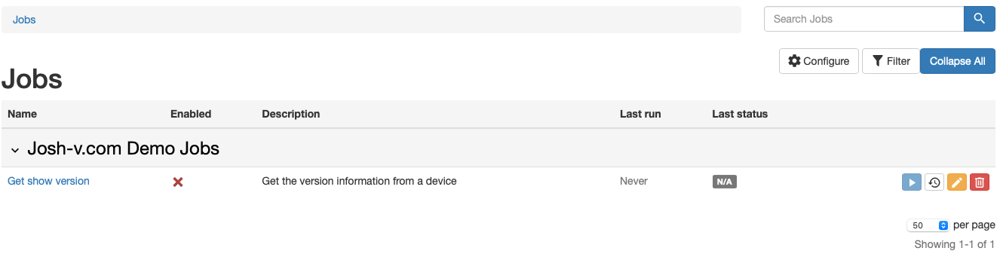
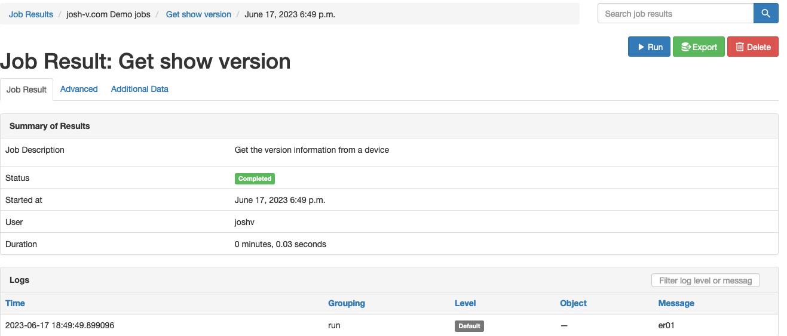
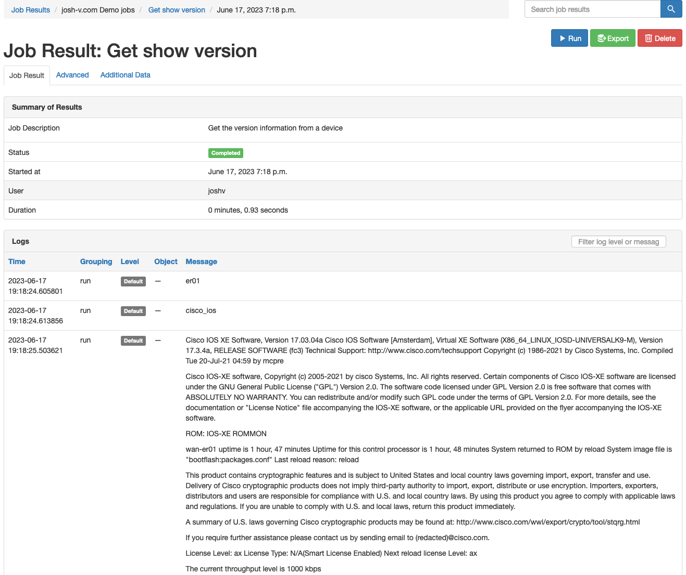

Today I was working to demonstrate how to get started with Nautobot Jobs within the Jobs root of Nautobot. This is not a pattern that I develop often, as I am typically developing Jobs within a plugin as my development standard. More to come on that later. During this case, the ask was to build a Job that would connect to a network device. I had a few troubles that I didn't want to have to work through on a call that had limited time and that was a screen share. So I am taking to working on this via a blog post to share, and hopefully will be helpful for others as well.

<!-- more -->

## Nautobot Documentation

The [Nautobot documentation](https://docs.nautobot.com/projects/core/en/stable/additional-features/jobs/?h=jobs) is pretty straight on. But it has grown organically over time. As such, this is going to be a small walkthrough in an _opinionated_ way. This post will dive into:

* Providing a Job form that will allow you to select a Device
* Connect to the device
* Execute a `show version` on the device as a method of connecting to the device

In this case I will be connecting to a Cisco device over SSH with Netmiko.

## Creating the Job

The default Jobs root path is `$NAUTOBOT_ROOT/jobs/`, which following the default install instructions for Nautobot is then `/opt/nautobot/jobs/` on a virtual machine install. With the default install the jobs directory comes with an `__init__.py` file:

```
nautobot@nautobot-host:~/jobs$ tree
.
└── __init__.py
```

Let's build out the structure. The Nautobot repository has an Example file (or use this as a starting point) to get started. In the repository there is an example plugin that has jobs in it as a reference. You can find the jobs information then here [https://github.com/nautobot/nautobot/blob/develop/examples/example_plugin/example_plugin/jobs.py](https://github.com/nautobot/nautobot/blob/develop/examples/example_plugin/example_plugin/jobs.py).

Here I'm executing `vim demo_jobs.py` from the `/opt/nautobot/jobs/` directory. In the end, the file just needs to be in the directory.

This will be a multiple step process. I like to debug the job along the way in order to know what I am working with. So the first iteration I include the following code to verify what is being sent in from the device form. Here is what the code looks like.

```python linenums="1"
from django.conf import settings

# Importing Nautobot DCIM device model in order to be able to choose what device I want to connect to
from nautobot.dcim.models import Device

# The import of Job is needed to inherit the Job class. This is the magic sauce for Nautobot Jobs.
# ObjectVar import will be used to select a device
from nautobot.extras.jobs import Job, ObjectVar

# Import Netmiko to connect to the device and execute commands
from netmiko import ConnectHandler

# Setting the name here gives a category for these jobs to be categorized into
name = "josh-v.com Demo jobs"

class GetShowVersion(Job):
    device = ObjectVar(
        model=Device, # Using the Device model imported to say I want to select devices
        query_params={
            # Using this as a method to make sure that the device has a primary IP address
            "has_primary_ip": True, 
            "status": "active", # Used to make sure that the device is active
            }
        )

    # I like to describe the class Meta as what information about the Job to pass into Nautobot to help describe the Job
    class Meta:
        name = "Get show version"
        description = "Get the version information from a device"
        # Define task queues that this can run in.
        task_queues = [
            settings.CELERY_TASK_DEFAULT_QUEUE,
            "priority",
            "bulk",
            ]

    # The code execution, all things for the job are here.
    def run(self, data, commit):
        device = data["device"]

        self.log_debug(device)


jobs = (GetShowVersion)
```

At this point, you can exit out and then execute `nautobot-server post_upgrade` and restart the services `sudo systemctl restart nautobot nautobot-worker nautobot-scheduler` from the server CLI (usually **not** the Nautobot user). During this process you should see the message:

```
01:49:20.083 INFO    nautobot.extras.utils :
  Created Job "josh-v.com Demo jobs: Get show version" from <local: GetShowVersion>
01:49:20.089 INFO    nautobot.extras.utils :
  Refreshed Job "josh-v.com Demo jobs: Get show version" from <local: GetShowVersion>
```

Then going into the UI menu of Jobs >>> Jobs you get the following result with the Job Enabled column having a red X on it.



To enable the Job for execution, take a look at the docs here on the [Nautobot Docs page](https://docs.nautobot.com/projects/core/en/stable/additional-features/jobs/?h=jobs#enabling-jobs-for-running) for enabling a Job.

When you execute the Job for a device, you now get a basic "Hello World" execution. You can see the result with the device name displayed.



### Get the Device Information From Nautobot

The best way to get the information available within a Nautobot object is to work within the shell_plus environment. On your Nautobot server as the Nautobot user, enter the command `nautobot-server shell_plus`. This will bring you into an interactive shell, hopefully an iPython like environment. If you do not get an iPython shell and you are on a development host (not production), then you can do a pip install to get iPython installed (`pip install ipython`).

```python linenums="1"
In [1]: mydevice = Device.objects.first()

In [2]: mydevice.name
Out[2]: 'er01'

In [3]: mydevice.platform
Out[3]: <Platform: Cisco IOS>

In [4]: mydevice.platform.name
Out[4]: 'Cisco IOS'

In [5]: mydevice.platform.slug
Out[5]: 'cisco-ios'

In [6]: mydevice.platform.napalm_driver
Out[6]: 'ios'

In [7]: mydevice.primary_ip
Out[7]: <IPAddress: 203.0.113.65/27>

In [8]: str(mydevice.primary_ip)
Out[8]: '203.0.113.65/27'

In [9]: mydevice.primary_ip.host
Out[9]: '203.0.113.65'

```

In the exploration with the shell, on lines 3 and 4 you see the verification that I'm working with the particular device that I wanted to work with. Lines 6 and 7 show that the platform name will come out as `Cisco IOS`. This will not work for using Netmiko connection to the device, so I then went exploring further of the data. I then saw on lines 15 and 16 something that I can work with for Netmiko. So I am going to use the NAPALM driver. If you need to do some conversions of NAPALM drivers over to Netmiko, there are some mapping utilities in the [NetUtils](https://netutils.readthedocs.io/en/latest/user/lib_overview/) library that can help. Lastly I explored how to get the IP address that I wanted to connect to. `mydevice.primary_ip` is a Nautobot object. That cannot be used in its own to connect to the host. I checked the string representation of the object, but that doesn't just get us the IP address. But I do know that the object has a separate `host` and `mask_length` objects. So I grabbed just the host for the Job.

The run method now looks like this:

```python linenums="1"
import os

# Used to convert NAPALM type to Netmiko type
from netutils.lib_mapper import NAPALM_LIB_MAPPER

# CODE OMITTED FOR BREVITY #
    # The code execution, all things for the job are here.
    def run(self, data, commit):
        device = data["device"]

        self.log_debug(device.name)

        net_device_info = {
            "device_type": NAPALM_LIB_MAPPER.get(device.platform.napalm_driver),
            "ip": device.primary_ip.host,
            "username": os.getenv("NAUTOBOT_NAPALM_USERNAME"),
            "password": os.getenv("NAUTOBOT_NAPALM_PASSWORD"),
        }

        self.log_debug(net_device_info['device_type'])
        net_device = ConnectHandler(**net_device_info)

        output = net_device.send_command("show version")

        self.log_debug(output)
```

On line 1 of the above example, the `import os` was added to get the environment variables to get the credential to connect to the device. This could be set, or you may want to use another method.

!!! note
    This is an example only. Environment variables have some considerations with that go along with them. There are also methods to work with the Nautobot Secrets providers that would be of better consideration here. But those were not added for the example of what it is that I'm trying to show in this post, how to connect and execute Netmiko Python scripts against a network device.


The import on line 4 is used for converting the NAPALM platform into a usable Netmiko platform.

When connecting to a network device in a multi-vendor environment there are a few considerations that need to be made. You need to know what the commands are needed to do various things. This is where the possibility of using [NAPALM](https://napalm.readthedocs.io/en/latest/) as a method to connect to devices and their use of "getters" would come in handy. This may be an idea for a future blog post. You can see the example on line 14 of the run method above the use of converting "ios" to "cisco_ios".

## Executing the Job

Now when you go to execute the job, you are able to get the `show version` output from the device to the screen. Take a look at the example:



## Summary

With Nautobot, there are many ways that you can get started with executing your own custom Jobs. By using Nautobot Jobs you can centralize your power scripts into one place, allowing for those power scripts to be put to use and then some by the entire organization, not just a select few. Take some design caution in what you do make available though. Nautobot centralizes, but also provides for authentication, user logging, and creates an API that is available for use to others. Looking for more on how the Jobs are an API endpoint, take a look at my [previous post on creating that API endpoint.](https://josh-v.com/nautobot-jobs-your-custom-api-endpoint/)

Thanks for the read and Happy Automating!

## Appendix - Full Code

Here is the full code block:

```python linenums="1"
import os
from django.conf import settings

# Importing Nautobot DCIM device model in order to be able to choose what device I want to connect to
from nautobot.dcim.models import Device

# The import of Job is needed to inherit the Job class. This is the magic sauce for Nautobot Jobs.
# ObjectVar import will be used to select a device
from nautobot.extras.jobs import Job, ObjectVar

# Import Netmiko to connect to the device and execute commands
from netmiko import ConnectHandler

# Used to convert NAPALM type to Netmiko type
from netutils.lib_mapper import NAPALM_LIB_MAPPER

# Setting the name here gives a category for these jobs to be categorized into
name = "josh-v.com Demo jobs"

class GetShowVersion(Job):
    device = ObjectVar(
        model=Device, # Using the Device model imported to say I want to select devices
        query_params={
            "has_primary_ip": True, # Using this as a method to make sure that the device has a primary IP address
            "status": "active", # Used to make sure that the device is active
            }
        )

    # I like to describe the class Meta as what information about the Job to pass into Nautobot to help describe the Job
    class Meta:
        name = "Get show version"
        description = "Get the version information from a device"
        # Define task queues that this can run in.
        task_queues = [
            settings.CELERY_TASK_DEFAULT_QUEUE,
            "priority",
            "bulk",
            ]

    # The code execution, all things for the job are here.
    def run(self, data, commit):
        device = data["device"]

        self.log_debug(device.name)

        net_device_info = {
            "device_type": NAPALM_LIB_MAPPER.get(device.platform.napalm_driver),
            "ip": device.primary_ip.host,
            "username": os.getenv("NAUTOBOT_NAPALM_USERNAME"),
            "password": os.getenv("NAUTOBOT_NAPALM_PASSWORD"),
        }

        self.log_debug(net_device_info['device_type'])
        net_device = ConnectHandler(**net_device_info)

        output = net_device.send_command("show version")

        self.log_debug(output)


jobs = (GetShowVersion)
```