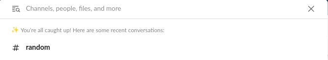

Recently Slack started introducing a new UI that is bringing back the importance of knowing keyboard shortcuts. Keyboard shortcuts within Slack are immensely helpful in my day to day, and it is essential for me being able to keep up with what is going on within my organization and some of the other 20 Slack organizations that I have joined. So much so, I don't believe that once I am in the Slack UI on my machines, I am ever touching the mouse to get from one place to another. About the only time I may need to use the mouse is to scroll back in the thread, so I'm not even clicking when using the mouse.

<!-- more -->

!!! note
    The keyboard shortcuts that I will be describing here will be demonstrated with `CMD + <keyboard key>`. These are for the Mac keyboard. If the Linux keyboard shortcuts of using the control key, should be the equivalent on the Windows platform as I understand it. If I am off on these keys, please let me know in the comments.

## My Common Keyboard Shortcuts

Slack makes the keyboard shortcuts available via `CMD + /`. This gives you the full list of commands that are available. 

### Navigating To Channels - Unread Channels

In my typical scenario I'm navigating between channels within an organization. The first thing that I'm doing is using `CMD + K` to find my unread channels. It gives a really nice list of the channels that are unread right at the top and in bold. You can then arrow down to those unread channel that you wish to look at and then press `enter` in order to get to the channel.

Here this has everything in an unread state, but you can see where you can start to navigate. If there were some channels that had not been read yet, they would appear here in bold.

### Navigating To Channels - Just Getting to Channel Name

The next step if you need to get to a particular channel, I'm following the similar start to the unread channels. I'm using `CMD +  k` to bring up the window again, but now the default is a search bar. This now allows you to just start typing. This is where I type the name of the channel that I'm looking for and then selecting it with the enter key again once it is highlighted.

### Navigating to a Direct Messages (DMs)

The direct message interface is a little different on the channels. If I'm looking to create a new DM conversation with someone, I'm using the combination of `CMD + Shift + k` to get to the DM window. This will then provide you the ability to type various contacts to get to the DM that you wish to complete.

This now brings up one of the newest quirks of the new Slack interface. You are taken to a whole new view. Once I am complete with my DM session that I started, I'm now trying to get back to the home view. On the Mac side of things this is accomplished with `Control + 1` to get to that view. The Linux/Windows side is a bit more complicated. There you need to use `Control + Shift + 1` to get to the home view.

### Workspace Switching

This is another quirky experience that we will dive into. The new UI has hidden the workspace switcher by default. If you wish to have the workspace switcher open for whatever scenario (like you just like them, or you have too many to use keyboard shortcuts), you can do so on Mac with `CMD + Shift + s` and on the Linux/Windows world with `Control + Shift + s`. This will allow you to change workspaces via the mouse again.

But this post is about my keyboard shortcuts. The workspace switching capability has some good shortcuts. This can be accomplished using `CMD + #` where `#` is the workspace number, similar to a tab experience on your web browsers. Here you can only go to 9 workspaces before you need to use a mouse, so this is where re-ordering workspaces is important.

## Summary

Keyboard shortcuts are what empowers me to move through the day and keep up quite quickly in the Slack workspaces these days. I hope that some of this information may help you as well. Are there some other keyboard shortcuts that you are using in your day to day interaction with Slack? Start a conversation in the discussions.

Josh