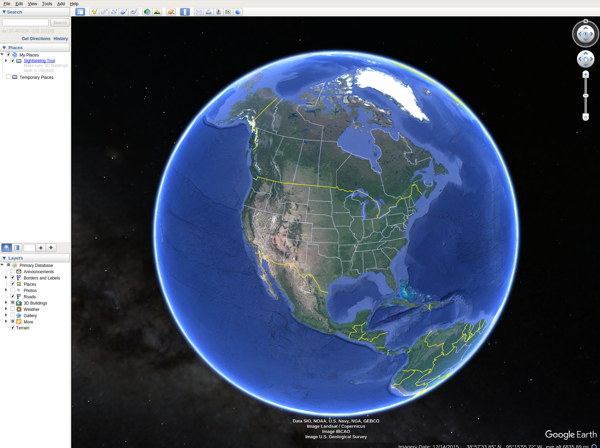
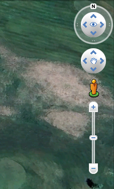
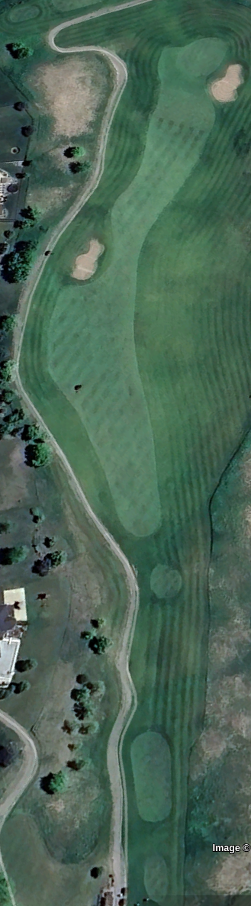
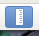
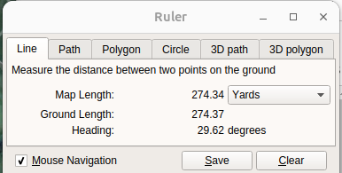
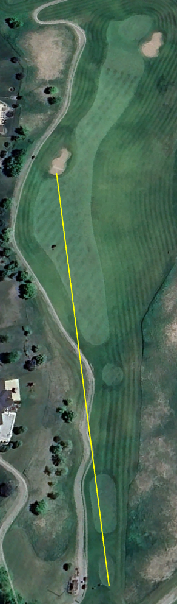
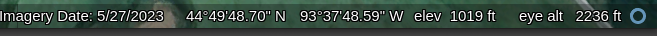

I'm going to diverge a small bit from the straight network automation space that I have blogged about primarily and dive a small bit into the world of using Google Earth to help prepare for your golf game. Upcoming, I'm playing in a Minnesota Golf event at two courses in late August. I'm going to put together a green book for myself and figure this would be a great topic to touch on how I'm going about this activity.

<!-- more -->

## Requirements

The first requirement is to have Google Earth installed on a desktop environment. This may be something that you can use the web version for, but I have had better luck using Google Earth Pro installed onto the desktop.

- [Google Earth Pro](https://www.google.com/earth/versions/)  
- [GIMP](https://www.gimp.org/downloads/)

The second requirement is a document (Microsoft Word, Google Doc, LibreOffice Writer) to build the content on. For this work I'm at least starting out with using Ubuntu 23 as my operating system. I will attempt to provide the same screen shot capabilities and editing for the Mac and Windows platforms as well.

## Getting Started with Google Earth

There are two main parts that I use when building my green books using Google Earth. The first is the ruler. This is how I am able to measure distances between points on the hole. The second piece is on the bottom right, there are some numbers to give you some more details, which I particularly focus on the `elev` which tells you what the elevation is when you hover over it..

## Mapping the Course

The first thing is to search for the golf course within Google Earth. In the search box on the upper right I am typing in the first course, `Chaska Town Course`. This will take you from the globe view down to the golf course. Then you need to be able to find the first hole to start taking a screen shot for each hole. This may take some more investigation if you have never played the course before. Look for practice ranges and practice greens which are likely to be around the first tee. Also, if you are able to find a scorecard with the distances of each hole, you can get an idea using the ruler about which hole is which.

Once you have the hole, it is time to zoom in on just the hole so you can get a good screenshot. For making a green book, use the navigation on the upper right to change the orientation (although you may want to keep the orientation for understanding the wind). Once you have the orientation the way that you like it, take the screen shot.

Now take that screen shot and place it into an image editor such as [GIMP](https://www.gimp.org/) which is available for Windows, Mac, and Linux. 

### Measuring Distances to Obstacles / Tee Shot Expectations

The ruler on Google Earth is an amazing option to work with. This provides as you expect a measurement between two points. Now for the golf side of things, off of the tee you may want to make either one measurement from the middle of the expected tees, or a couple of measurements from the front and back of the tee boxes. This gives you the starting point of what to know once you are on the course. Measuring from the center of the tee box you will need to approximate where things are. I'm going to measure from the back of tee boxes, since often I will likely walk past the point and my pace of yards is known and I can get an understanding of how the course is playing from there.

With the ruler, you click once to set the first point, then click again to set the end point. The ruler itself then has a pop up window that provides the metrics, including the length of the line, and the heading at which the line is on. Measure the distance from your point to the various data points on the course. On the first hole at Chaska Town Course, I will map the distance to the bunker on the left hand side, it measures in the neighborhood of 274 yards from the back of the back most tee box to the sand trap, and 296 yards to the back of the sand trap. I may make two measurements, one from the most far back tee box, and one from the back of a middle tee box. This way there are two measurements to keep the pace of play moving in case one of the tees is at a location that is not expected.

> I'm not worrying about yardages from the objects to the green, except maybe on some par 5 holes. But once on the course and I've hit my tee shot, I will have a different distance to each area.

### Measuring Elevation

Now that there are some yardages off the tee, comes the part that you don't get from mobile golf apps today. You now want to plot the elevation. To do this, I hover my mouse over various points along the hole to give an idea of the elevation. And most importantly, I check out the 9 points of the green. I make a box around the green with the center elevation, elevation on the top left, top center, and so on. This is helpful to understand the general slope of the green and which way the ball is likely to break.

!!! abstract
    The USGA app itself also offers green books that have much more details slopes on them. There is an annual cost for this green book and I am one that is supporting technology innovations by the USGA. I'm glad to show interest and pay them a bit of revenue in order to continue to develop technology advances for golf. [Android](https://play.google.com/store/apps/details?id=com.advancedmobile.android.ghin&hl=en_US&gl=US) [Apple](https://apps.apple.com/us/app/ghin/id491796218)

Off of the tee is where you are likely to need this, as well as understanding various points along the way. So this way you know if you are hitting into an elevated green or not. Elevation changes do generally impact the distance that clubs go. So I'm taking the elevation at the tee box, the general fairway/rough areas, and since I've done this for the green book I then know if I'm going to be uphill or downhill to the hole.

All of these are manually entered into the GIMP editor. I'm using one color for yardages to the obstacles and another for the elevation numbers. I'm also going to put the two measurement points with an X to make sure to know where the two measurements are sourced from.

### Final Look

## Putting All Together

Once you have completed building your images of each hole, now you add the images to your document editor. This can be set up for however you may like size wise. You may need to work on how many pages you may want per page and the sizing that you would be looking for. I would be looking to put 6 holes on a page to be able to make the appropriate updates.

## Summary

This is not the most professional of green books out there. But then again, I'm not getting paid to play the game of golf either (at least not today). This is a way to look at some of the many great tools out there that are generally available for you to be able to leverage in your day to day. It may not be built specifically for this purpose, but another great use.