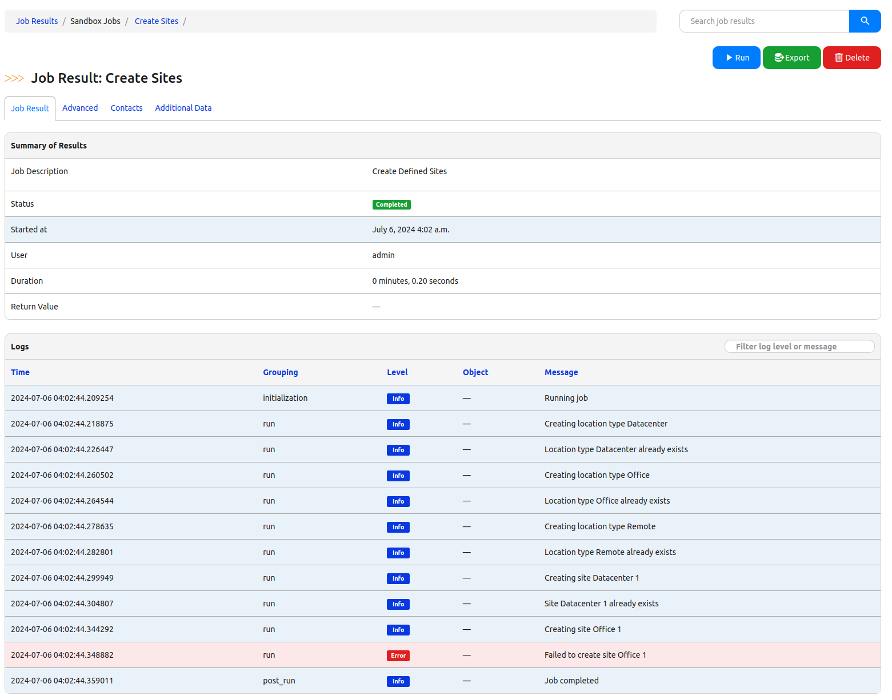
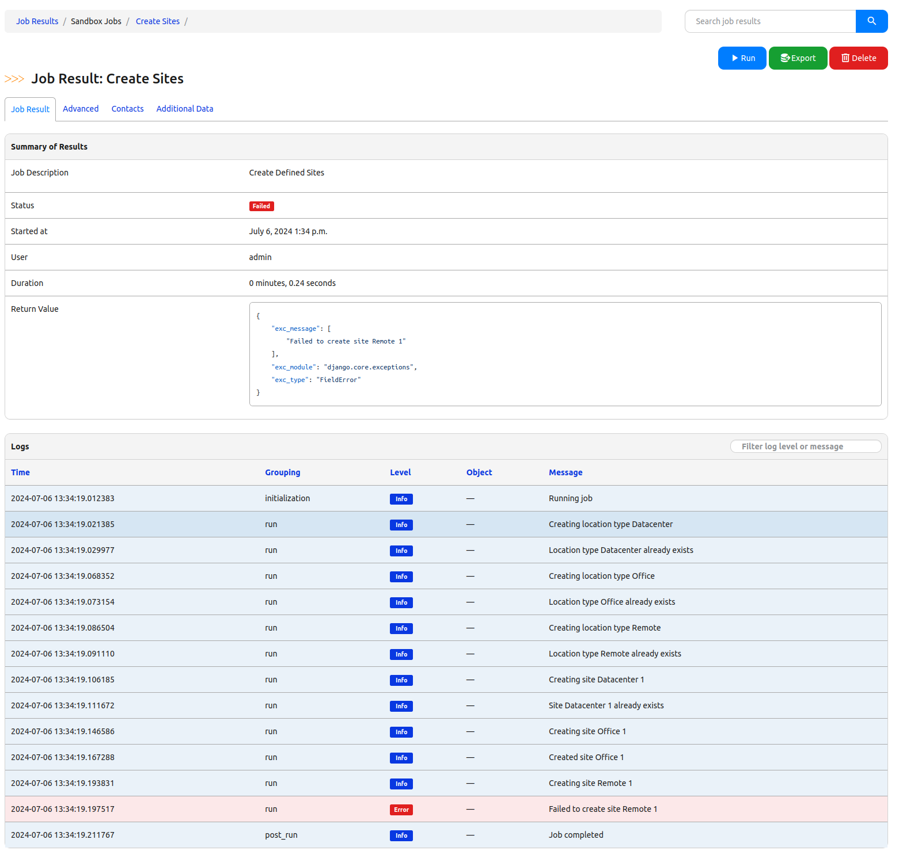

In the first release of Nautobot all of the Jobs were Atomic by default. This was from the previous focus of the legacy source application that assumed that scripts/reports would only be run on the data locally, so by that nature, the jobs should be atomic. As more and more Jobs started to interact with other systems, it became apparent that there needed to be a control mechanism provided (as I understand). So the introduction of a context manager and decorator was brought to the table to provide the same previous functionality while changing of the default behavior in Nautobot 2.x+.

<!-- more -->

## Writing that Atomic Job

Let's take a look at using an example Job that will create 3 location types and 3 locations, 1 of each of those types. I will purposely put an error in the data to demonstrate the atomic nature. The file structure looks like the following for my sandbox environment, which was generated from the Nautobot App Cookiecutter:

```bash linenums="1" title="Tree output of file structure"
sandbox/
├── app-config-schema.json
├── __init__.py
├── jobs
│   ├── demo_jobs.py
│   ├── __init__.py
└── tests
    ├── __init__.py
    ├── test_api.py
    └── test_basic.py
```

### Init File

First the `__init__.py` file contains the registration information for the Jobs. The `register_jobs()` function on line 6 is what will register the jobs. It takes in the list of Jobs that are exploded out with the `*jobs` call.

```python linenums="1" title="jobs/__init__.py"
"""Jobs definition."""
from nautobot.apps.jobs import register_jobs
from .demo_jobs import CreateSites

jobs = [CreateSites]
register_jobs(*jobs)
```

### Job File

The job itself as you could make out will be in the `demo_jobs.py` file. For demonstration purposes, I will be putting the data right into the file. For a more production like environment, you would likely have a file that gets fed to the job. For this you will see that I have added `slug` to two of the locations defined on lines 44-49. These lines are highlighted.

```python linenums="1" title="jobs/demo_jobs.py" hl_lines="46-48"
"""Demonstration of Jobs."""
from nautobot.apps.jobs import Job
from nautobot.dcim.models import LocationType, Location
from nautobot.extras.models import Status

name = "Sandbox Jobs"

status_active = Status.objects.get(name="Active")

class CreateSites(Job):
    """Create Sites Job."""

    class Meta:
        """Meta Class."""

        name = "Create Sites"
        description = "Create Defined Sites"
        commit_default = False

    def run(self):
        """Run Method."""
        # Perform the work of the job
        # Create location types
        location_types = [
            {"name": "Datacenter"},
            {"name": "Office"},
            {"name": "Remote"},
        ]

        location_type_objects = {}
        for location_type in location_types:
            self.logger.info(f"Creating location type {location_type['name']}")
            location_type_obj, _created = LocationType.objects.get_or_create(**location_type)
            if _created:
                self.logger.info("Created location type %s", location_type_obj)
            else:
                self.logger.info("Location type %s already exists", location_type_obj)
            location_type_obj.validated_save()

            # Add to the location_type_objects dictionary with the name as the key
            location_type_objects[location_type["name"]] = location_type_obj

        # Create sites
        sites = [
            {"name": "Datacenter 1", "location_type": "Datacenter"},
            # This has some bad data, slug is no longer part of the system
            {"name": "Office 1", "slug": "office_1", "location_type": "Office"},
            {"name": "Remote 1", "slug": "remote_1", "location_type": "Remote"},
        ]

        for site in sites:
            self.logger.info(f"Creating site {site['name']}")
            site_dictionary = {
                "name": site["name"],
                "location_type": location_type_objects[site["location_type"]],
                "status": status_active,
            }
            if site.get("slug"):
                site_dictionary["slug"] = site["slug"]

            site_obj, _created = Location.objects.get_or_create(**site_dictionary)
            if _created:
                self.logger.info("Created site %s", site_obj)
            else:
                self.logger.info("Site %s already exists", site_obj)
            site_obj.validated_save()
```

On the first execution of this Job where there is not an Atomic transaction set, you will expect to have all of the Location Types created, the first location. The job will fail. You can see where that job failed in that the logging indicated a site was being created, but there was not a creation.


But the objects will stay created as shown below.


### Add In Error Handling

Let's add some better logging on the job here to report an error. 

```python linenums="1" title="Updated job code" hl_lines="2 71-73"
"""Demonstration of Jobs."""
from django.core.exceptions import FieldError

from nautobot.apps.jobs import Job
from nautobot.dcim.models import LocationType, Location
from nautobot.extras.models import Status

name = "Sandbox Jobs"

status_active = Status.objects.get(name="Active")

class CreateSites(Job):
    """Create Sites Job."""

    class Meta:
        """Meta Class."""

        name = "Create Sites"
        description = "Create Defined Sites"
        commit_default = False

    def run(self):
        """Run Method."""
        # Perform the work of the job
        # Create location types
        location_types = [
            {"name": "Datacenter"},
            {"name": "Office"},
            {"name": "Remote"},
        ]

        location_type_objects = {}
        for location_type in location_types:
            self.logger.info(f"Creating location type {location_type['name']}")
            location_type_obj, _created = LocationType.objects.get_or_create(**location_type)
            if _created:
                self.logger.info("Created location type %s", location_type_obj)
            else:
                self.logger.info("Location type %s already exists", location_type_obj)
            location_type_obj.validated_save()

            # Add to the location_type_objects dictionary with the name as the key
            location_type_objects[location_type["name"]] = location_type_obj

        # Create sites
        sites = [
            {"name": "Datacenter 1", "location_type": "Datacenter"},
            # This has some bad data, slug is no longer part of the system
            {"name": "Office 1", "slug": "office_1", "location_type": "Office"},
            {"name": "Remote 1", "slug": "remote_1", "location_type": "Remote"},
        ]

        for site in sites:
            self.logger.info(f"Creating site {site['name']}")
            site_dictionary = {
                "name": site["name"],
                "location_type": location_type_objects[site["location_type"]],
                "status": status_active,
            }
            if site.get("slug"):
                site_dictionary["slug"] = site["slug"]

            try:
                site_obj, _created = Location.objects.get_or_create(**site_dictionary)

                if _created:
                    self.logger.info("Created site %s", site_obj)
                else:
                    self.logger.info("Site %s already exists", site_obj)
                site_obj.validated_save()
            except FieldError:
                self.logger.error(f"Failed to create site {site['name']}")
                raise FieldError(f"Failed to create site {site['name']}")
```

Now with the error handling in place to catch the field error, you get the output of what failed as well as a log message indicating that there was a failure.



## Making a Job Atomic

Let's look at making this atomic in nature so that all of the objects are created only when the entire job succeeds. Before making any update to the code, let's check out the Locations interface.


The code below fixes just one of the lines to remove slug from the data that is being fed in. This way we can demonstrate that we will only still see the single site and get the Atomic nature. That line change is on line 50. The highlighted lines show the two changes necessary to make the Nautobot Job an atomic job.

```python linenums="1" title="Final Job with Atomic Transaction" hl_lines="2 23"
"""Demonstration of Jobs."""
from django.core.exceptions import FieldError
from django.db import transaction

from nautobot.apps.jobs import Job
from nautobot.dcim.models import LocationType, Location
from nautobot.extras.models import Status

name = "Sandbox Jobs"

status_active = Status.objects.get(name="Active")

class CreateSites(Job):
    """Create Sites Job."""

    class Meta:
        """Meta Class."""

        name = "Create Sites"
        description = "Create Defined Sites"
        commit_default = False

    @transaction.atomic
    def run(self):
        """Run Method."""
        # Perform the work of the job
        # Create location types
        location_types = [
            {"name": "Datacenter"},
            {"name": "Office"},
            {"name": "Remote"},
        ]

        location_type_objects = {}
        for location_type in location_types:
            self.logger.info(f"Creating location type {location_type['name']}")
            location_type_obj, _created = LocationType.objects.get_or_create(**location_type)
            if _created:
                self.logger.info("Created location type %s", location_type_obj)
            else:
                self.logger.info("Location type %s already exists", location_type_obj)
            location_type_obj.validated_save()

            # Add to the location_type_objects dictionary with the name as the key
            location_type_objects[location_type["name"]] = location_type_obj

        # Create sites
        sites = [
            {"name": "Datacenter 1", "location_type": "Datacenter"},
            {"name": "Office 1", "location_type": "Office"},
            # This has some bad data, slug is no longer part of the system
            {"name": "Remote 1", "slug": "remote_1", "location_type": "Remote"},
        ]

        for site in sites:
            self.logger.info(f"Creating site {site['name']}")
            site_dictionary = {
                "name": site["name"],
                "location_type": location_type_objects[site["location_type"]],
                "status": status_active,
            }
            if site.get("slug"):
                site_dictionary["slug"] = site["slug"]

            try:
                site_obj, _created = Location.objects.get_or_create(**site_dictionary)

                if _created:
                    self.logger.info("Created site %s", site_obj)
                else:
                    self.logger.info("Site %s already exists", site_obj)
                site_obj.validated_save()
            except FieldError:
                self.logger.error(f"Failed to create site {site['name']}")
                raise FieldError(f"Failed to create site {site['name']}")
```

When this code runs, even though there was now another site that would be created - _Office 1_, there is an error that occurs with trying to create _Remote 1_. That is that the `slug` is not actually a valid key word argument. Thus the failure:



And when you look at the locations, the site _Office 1_ is not there, because the database changes were rolled back as part of the atomic transaction.


## Atomic Job Design Considerations

When working with atomic based transactions, it is recommended (at least from me) to handle as much of the database based work early in the job. Any database transaction will be rolled back automatically as part of the atomic nature of the job. However, any work with third party APIs or systems (such as network devices) will be automatic as part of this. __You will need to design the same atomic nature in the third party systems.__

## Summary

With the adding of an atomic transaction type from the Django project we are able to make sure that the Job completes successfully before saving the data to the database. If any part of the job fails you are able to have the data get rolled back. Design [considerations](#atomic-job-design-considerations) should be taken into account with atomic jobs that interact with third party systems. This is a powerful component that comes part of the general nature of working with databases. But proper care needs to be taken into account.

Let me know your thoughts! Comment below or on social media. Give it a share.

-Josh