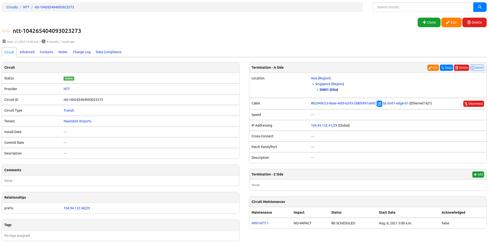

This one is a little bit more of the discussion about the WAN design post than an automation specific post. This post will dive into how I would solve a question that I was approached with the question of, "My home internet costs only $35 per month. Why do we spend $xxx per month per circuit?"

<!-- more -->

This question is definitely something that I would say that in 2024 and beyond, we should not need to worry about as WAN engineers. As long as we are designing for the appropriate expected availability (which I did a [post](https://josh-v.com/designing-wan-availability/) on before), the types of circuits are no longer a concern.

## Scenario

The WAN environment that we had supported many critical applications for the day to day business. Including providing a method for all of the companies revenue (online was still in its infancy back then) to be processed. The design was a "cookie cutter" design in that all of the locations looked the same. As part of that design of every site looking the same, came the cost of having to get the same type of circuit for each of the sites. From this it caused the team to have a very few number of possible suppliers, which decreased the competition there was available for systems.

There were a few differences in the hardware at each of the locations, that some one time config generation templates generated the config for, which had some logic built in around what type of WIC was installed on the router.

## What I Would Do Differently

Originally when I started out writing this post I had just one thing on the mind about how I would have done things differently, using a more accessible circuit database. But as I started writing I identified a second thing, updating the template generator. Let's dive into the first one about the circuit design. With the first solution of a Circuit Warehouse/Database, I would be able to get whatever the best priced Internet provider was. If the location was able to be serviced by Google Fiber (which didn't get a ton of US deployment) and that was the best priced service there - done :heavy_check_mark:. Need to use a cable modem service somewhere instead of direct fiber for whatever reason - :heavy_check_mark:. Need to use a satellite based service due to availability or otherwise - :heavy_check_mark:. Same thing for if cellular were the best available - :heavy_check_mark:

### Solution: Circuit Warehouse/Database

The first thing I would look at doing is using a SOT like Nautobot as my Circuit Warehouse/Database. Within Nautobot there is the capability to track the important pieces such as the circuit ID, the provider of the circuit, the type of circuit is, and then the connection at which the circuit makes. You can see this image at the Nautobot demo instance - [Demo Nautobot](https://demo.nautobot.com/circuits/circuits/6b2c4c96-2b3e-4533-b085-9fe31a58dbdc/?tab=main). You can see on the right hand portion of the image that this circuit is connected to `sin01-edge-01` device on interface `Ethernet16/1`.

So why would I look at doing this? With this information I can now use Python or Ansible to generate the configuration for the interface. And when it comes to what the interface variables are for things such as IP addressing, interface type, port speed, shaping configuration, and so on, I can now leverage Nautobot's API to get the information. This allows for me to have different circuit types, different service providers, and so on throughout the environment. And since the information is readily available at your first pane of glass (upcoming blog post), it is able to provide operational data quickly. And with the [Nautobot ChatOps](https://docs.nautobot.com/projects/chatops/en/latest/user/app_overview/) you could bring this information to your help desk team members (whether you are on MS Teams, WebEx, Slack, or Mattermost). 

I forget the exact timing of when the organization adopted a Telecom Expense Management (TEM) platform. It may have been around that time, but the TEM system was brought in more around the expense side of things, rather than being used as an extensible platform that you could gather data from. Also at the time, I was definitely not aware of the concept of APIs at that time. So even had the system been available via API, I would not have been aware of how to get the data from there.

### Look at Updating The Template Generator to Run On Demand

The generator script that had been given to me to run was written in Perl. That in its own right isn't necessarily a bad thing, it was just a language that was difficult for me at the time to read and to comprehend. It was tied to a spreadsheet that had to be updated in order to be executed properly.

At the time I should have taken that command line utility and updated it to support being able to take inputs at the CLI so that the configuration could be generated for a single device at a time. Python 2.6 had just been released at about that time frame, but I was not exposed to the idea of Python until 2015.

#### Templating Configurations Today

Today I would be looking at building configuration templates using [Python Jinja :simple-jinja:](https://jinja.palletsprojects.com/en/3.1.x/). This templating language works for [Python :simple-python:](https://www.python.org/), [Ansible :simple-ansible:](https://www.ansible.com/), [Nautobot Golden Configuration](https://docs.nautobot.com/projects/golden-config/en/latest/), and many other Network Automation related projects. That alone makes this the current clear winner in templated configuration generation.

## Summary

Things often change with time, that is definitely a constant here. There are now ways that I would handle much differently and that continues into the design of the WAN. There once was a heavily pursued WAN type of having native Ethernet service available everywhere from a service provider. Now days it is less so that a single provider would provide an Ethernet handoff to a business but you should be able to get Ethernet services no matter where you are in the United States, just needing to find the right service provider at each of them. Having a Circuit Warehouse/Database such as Nautobot to handle the detail at the site level and provide the data needed that will provide the rest of the details to make the configuration work at each site.